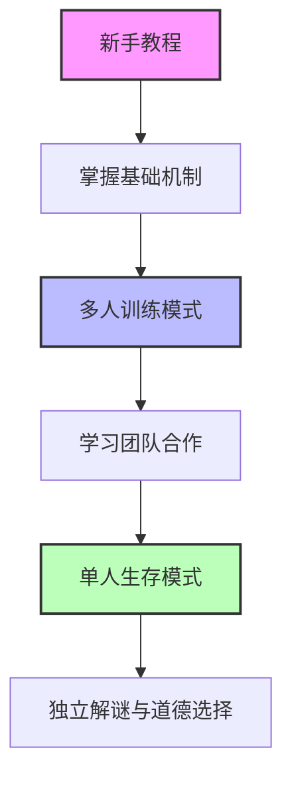

# 新手剧本123剧情梗概与写作指南

> **文档目标**：为《惊悚乐园》新手剧本1、2、3提供详细的剧情梗概、写作注意事项和参考模板，方便后续写作时快速调用
> **分析基础**：基于新手剧本1（第001-003章）、剧本2（第004-010章）、剧本3（第011-015章）原文内容
> **适用对象**：希望创作《惊悚乐园》风格同人作品或类似剧本的作者
> **创建时间**：2026年2月25日
> **关联文档**：《新手副本同人创作指南.md》、《新手副本写作技巧分析.md》

---

## 第一部分：剧本概览与递进关系

### 1.1 三个剧本的基本信息

| 剧本 | 章节范围 | 游戏模式 | 核心主题 | 关键机制教学 |
|------|----------|----------|----------|--------------|
| **剧本1** | 第001-003章 | 新手教程（单人） | 恐怖追逐与基础解谜 | 生存值、体能值、惊吓值、技巧值、物品系统 |
| **剧本2** | 第004-010章 | 多人训练模式 | 超自然调查与团队合作 | 多人游戏规则、剧情物品收集、BOSS战 |
| **剧本3** | 第011-015章 | 单人生存模式（普通） | 道德选择与密室逃脱 | 支线任务、世界观破解、拼图牌系统 |

### 1.2 剧本递进关系分析



**递进逻辑**：
1. **认知阶段**（剧本1）：玩家熟悉游戏基础界面和核心机制
2. **体验阶段**（剧本2）：在相对安全的环境中体验团队合作和剧情探索
3. **实践阶段**（剧本3）：独立面对道德困境和复杂解谜，为正式游戏做准备

---

## 第二部分：分剧本详细梗概

### 2.1 剧本1：血尸追逐战（第001-003章）

#### 剧情结构
```
第一章：游戏引入 → 第二章：恐怖追逐 → 第三章：战斗结算
```

#### 关键情节节点
1. **游戏登录与角色建立**（第001章）
   - 封不觉登录游戏，阅读免责声明
   - 介绍主角异常设定（失去恐惧）
   - 创建昵称"疯不觉"
   - 进入新手教程

2. **恐怖环境引入**（第002章前半）
   - 电梯突然变黑，听到恐怖声音
   - 灯光一闪看到镜中血尸
   - 电梯门打开，进入恐怖走廊
   - 遭遇无皮血尸，开始追逐

3. **解谜逃生**（第002章后半）
   - 逃入房间，发现被锁的门
   - 找到墙纸后的钥匙图案
   - 打破木板获得生锈的铁钥匙
   - 开门逃往室外台阶

4. **最终战斗**（第003章）
   - 爬上台阶发现巨剑"血尸必须死"
   - 血尸加速追击
   - 封不觉挥剑斩杀血尸
   - 完成教程，返回登陆空间

5. **奖励结算**（第003章后半）
   - 获得经验值、游戏币、技巧值
   - 恐惧评级：浑身是胆（惊吓值0%）
   - 获得新手行囊
   - 额外奖励抽取到"石头"

#### 游戏机制教学点
- **生存值系统**：百分比显示，0%即死亡
- **体能值系统**：具体数值，消耗于各种行动
- **惊吓值系统**：百分比，超过100%强制断开连接
- **技巧值系统**：提升游戏效率的行为获得
- **物品系统**：剧情物品与装备的区别

### 2.2 剧本2：医院超能力儿童（第004-010章）

#### 剧情结构
```
现实铺垫 → 组队进入 → 环境调查 → BOSS战 → 结算分离
```

#### 关键情节节点
1. **现实铺垫**（第004章）
   - 封不觉下线等待朋友王叹之
   - 介绍封不觉的现实生活（推理小说家）
   - 介绍王叹之（发小、医学院学生）
   - 两人约定一起游戏

2. **组队进入**（第005章）
   - 封不觉与王叹之组队
   - 选择多人训练模式
   - 学习多人游戏规则（防骚扰条款）
   - 进入医院环境

3. **初始恐怖事件**（第005-006章）
   - 听到小女孩笑声
   - 墙面出现无数血手印
   - 看到黑影闪过转角
   - 王叹之惊吓值上升

4. **环境调查**（第006-009章）
   - 调查三间病房
   - 第一间：找到病历（12岁白血病男孩）
   - 发现六张人脸素描
   - 收集剧情物品

5. **BOSS遭遇与战斗**（第009-010章，从上下文推断）
   - 遭遇超能力儿童（推测为病历中的男孩）
   - 团队合作战斗
   - 利用收集的线索破解BOSS机制
   - 最终击败BOSS

6. **结算与分离**（第010章）
   - 获得经验值奖励
   - 两人解除组队
   - 封不觉准备进入单人生存模式

#### 多人游戏特点
- **社交系统**：好友列表、黑名单、邮件功能
- **防骚扰机制**：敏感词过滤、行为限制
- **团队协作**：分工调查、资源共享
- **难度平衡**：根据队伍人数和等级调整

### 2.3 剧本3：竖锯风格密室（第011-015章）

#### 剧情结构
```
剧本引入 → 道德困境 → 解谜逃脱 → 系统揭示 → 奖励结算
```

#### 关键情节节点
1. **剧本引入**（第010章结尾-第011章开头）
   - 封不觉选择单人生存模式
   - 获得剧本简介：摄影记者亚瑟·席格
   - 从昏迷中醒来，发现walkman
   - 听到竖锯风格录音

2. **第一个道德游戏**（第011章）
   - 进入第一个房间
   - 发现绞碎机器和倒计时
   - 规则：放入15千克物体开门
   - 困境：玩偶+椅子=7.5kg，麻醉猴子=10kg
   - 道德选择：是否牺牲动物换取生存

3. **后续解谜环节**（第012-014章，从上下文推断）
   - 通过第一个房间
   - 进入更多竖锯风格游戏
   - 每个房间都有道德或智力挑战
   - 需要破解谜题继续前进

4. **最终逃脱**（第014章结尾，从上下文推断）
   - 完成所有房间挑战
   - 找到出口
   - 成功逃脱仓库

5. **奖励结算与系统揭示**（第015章）
   - 获得经验值、游戏币、技巧值
   - 获得剧情物品"昏睡的藏猕猴"
   - 恐惧评级：浑身是胆
   - 拼图牌系统揭示
   - 获得技能卡

#### 核心机制揭示
- **拼图牌系统**：可带出剧本的剧情物品转化为拼图牌
- **套牌系统**：凑齐系列拼图牌可兑换精良以上装备
- **道德选择**：游戏不仅考验智力，更考验道德立场
- **世界观破解**：剧本可能包含隐藏世界观

---

## 第三部分：写作注意事项

### 3.1 剧本1写作要点

#### 恐怖氛围营造
- **渐进式恐怖**：从声音→视觉→实体的递进
- **环境细节**：腐败气味、诡异墙纸、昏暗灯光
- **心理暗示**：通过描述常人反应对比主角异常

#### 新手教学融入
- **自然引入**：在玩家需要时展示系统功能
- **重复强化**：关键机制多次出现
- **实践结合**：教学后立即提供应用场景

#### 主角塑造
- **异常设定展示**：通过具体行为而非旁白
- **性格细节**：阅读癖、冷静分析、自嘲幽默
- **能力成长**：从观察到行动的逻辑递进

### 3.2 剧本2写作要点

#### 多人互动设计
- **角色分工**：封不觉（智力）、王叹之（医疗知识）
- **对话自然**：符合角色性格和关系
- **团队协作**：调查分工、资源共享

#### 超自然元素
- **渐进揭示**：血手印→黑影→完整实体
- **线索关联**：病历、素描、环境细节相互印证
- **逻辑自洽**：超自然现象有内在规则

#### 训练模式特点
- **相对安全**：死亡惩罚较轻
- **探索鼓励**：隐藏物品和线索
- **教学延续**：巩固剧本1学到的机制

### 3.3 剧本3写作要点

#### 道德困境设计
- **两难选择**：生存 vs 道德
- **后果展现**：选择有明确游戏内影响
- **角色关联**：困境与角色背景相关

#### 解谜逻辑
- **线索明确**：玩家有足够信息做出决策
- **多重解法**：允许创造性解决方案
- **时间压力**：倒计时增加紧张感

#### 竖锯风格把握
- **规则明确**：游戏规则清晰易懂
- **公平性**：玩家有实际逃脱可能
- **主题深刻**：超越单纯恐怖，探讨人性

### 3.4 通用写作注意事项

#### 系统提示处理
- **时机恰当**：在玩家需要信息时出现
- **风格统一**：系统语言简洁正式
- **反应衔接**：每次提示后都有角色反应

#### 幽默平衡
- **反差幽默**：恐怖场景中的冷静反应
- **性格幽默**：符合角色特点的调侃
- **密度控制**：根据场景紧张程度调整

#### 节奏控制
- **张弛有度**：恐怖段落与缓冲段落交替
- **信息分层**：重要信息分阶段释放
- **悬念设置**：章节结尾留有钩子

---

## 第四部分：参考模板

### 4.1 剧本结构模板

#### 模板A：新手教程剧本（3章结构）
```markdown
# 第一章：引入与建立
1. 游戏登录过程
2. 角色异常设定介绍
3. 基础系统教学（生存值、体能值、惊吓值）
4. 进入教程的悬念结尾

# 第二章：体验与学习
1. 初始恐怖事件
2. 基础操作实践（移动、观察、互动）
3. 简单解谜教学
4. 追逐或躲避环节
5. 获得关键物品

# 第三章：应用与结算
1. 使用所学技能解决问题
2. 最终挑战（战斗或逃脱）
3. 完成教程
4. 返回登陆空间
5. 奖励结算与系统解锁
```

#### 模板B：多人训练剧本（5-7章结构）
```markdown
# 现实铺垫（可选）
1. 角色现实生活描写
2. 组队动机与过程

# 组队进入
1. 多人游戏规则介绍
2. 剧本环境引入
3. 初始团队互动

# 调查阶段
1. 环境探索与线索收集
2. 团队分工与合作
3. 超自然现象初次出现

# 解谜阶段
1. 线索整合与推理
2. 剧情背景揭示
3. BOSS机制发现

# 挑战阶段
1. BOSS遭遇
2. 团队协作战斗/解谜
3. 利用收集的线索破解机制

# 结算阶段
1. 奖励获得
2. 团队解散或继续
3. 为下一剧本铺垫
```

#### 模板C：单人生存剧本（4-6章结构）
```markdown
# 剧本引入
1. 剧本简介播放
2. 角色背景与困境
3. 初始环境调查

# 道德/智力游戏1
1. 游戏规则说明
2. 困境呈现
3. 玩家决策与后果

# 道德/智力游戏2-N
1. 新房间/新规则
2. 递增的难度
3. 线索关联与剧情推进

# 最终挑战
1. 综合所有线索
2. 最终道德选择或解谜
3. 逃脱或胜利条件达成

# 结算与揭示
1. 奖励结算
2. 新系统揭示（如拼图牌）
3. 为后续内容铺垫
```

### 4.2 场景写作模板

#### 恐怖场景模板
```markdown
**环境描写**（视觉、听觉、嗅觉综合）：
- 视觉：昏暗光线、诡异细节、异常物体
- 听觉：奇怪声音、寂静中的细微响动
- 嗅觉：腐败、消毒水、血腥等气味

**常人反应对比**：
- 描述一般人此时会有的恐惧反应
- 与主角的异常反应形成反差

**恐怖事件发生**：
- 渐进式：暗示→部分显现→完整出现
- 突然式：平静中的突然惊吓

**主角反应**：
- 冷静分析环境与威胁
- 基于角色设定的独特应对
- 可能包含反差幽默
```

#### 解谜场景模板
```markdown
**谜题呈现**：
- 环境线索：异常物体、图案、文字
- 规则说明：系统提示或剧情物品
- 限制条件：时间、资源、能力

**调查过程**：
- 系统化环境扫描
- 线索发现与记录
- 假设形成与验证

**推理展示**：
- 内心独白展示思考过程
- 逻辑链条构建
- 可能包含错误尝试与修正

**解决方案**：
- 基于线索的合理解决
- 角色能力或物品的应用
- 结果与奖励获得
```

#### 对话场景模板
```markdown
**系统提示对话**：
```
【系统提示内容】
角色反应：（符合性格的吐槽或分析）
```

**队友对话**：
```
角色A：（基于性格和关系的发言）
角色B：（符合其性格的反应，可能包含情绪变化）
互动：（信息交换、决策讨论、性格碰撞）
```

**NPC/剧情对话**：
```
NPC：（符合其背景和目的的语言）
玩家选择：（基于角色性格的回应）
剧情推进：（对话导致的剧情发展）
```
```

### 4.3 物品描述模板

#### 装备描述模板
```markdown
【名称：[物品名称]】
【类型：[武器/防具/饰品等]】
【品质：[垃圾/破败/普通/精良/完美/传说]】
【攻击力/防御力：[具体描述]】
【属性：[如有]】
【特效：[如有]】
【是否可带出该剧本：[是/否]】
【备注：[幽默、背景信息或使用提示]】
```

#### 剧情物品描述模板
```markdown
【名称：[物品名称]】
【类型：[剧情相关]】
【品质：[通常为普通]】
【功能：[未知或具体功能]】
【是否可带出该剧本：[是/否]】
【备注：[线索提示或背景信息]】
```

#### 消耗品描述模板
```markdown
【名称：[物品名称]】
【类型：[消耗品]】
【品质：[通常为普通或以下]】
【功能：[具体效果]】
【是否可带出该剧本：[通常为是]】
【备注：[使用说明或幽默注释]】
```

### 4.4 系统提示模板

#### 机制教学提示
```markdown
【这是您的[机制名称]，以[显示方式]显示。[具体规则说明]。当前[机制名称]：[当前数值]。】
```

#### 任务更新提示
```markdown
【任务更新】
- [任务类型]：[任务内容]（进度[百分比]）
- [新发现]：[物品或信息]
- [警告/提示]：[重要信息]
```

#### 获得奖励提示
```markdown
【您获得[奖励类型]，[数量]点，此提示仅一次，今后您可在游戏菜单中查看[奖励类型]的变化。】
```

#### 剧本开始提示
```markdown
【载入已完成，当前您正在进行的是[游戏模式]。】
【本模式提供剧本简介，并有几率出现支线/隐藏任务及特殊世界观。】
【剧本通关奖励：[奖励内容]。】
【即将播放剧本简介，播放完成后游戏即刻开始。】
```


---

## 第五部分：快速参考表

### 5.1 关键情节索引

| 剧本 | 关键情节 | 对应章节 | 写作要点 |
|------|----------|----------|----------|
| **剧本1** | 电梯恐怖事件 | 第001-002章 | 渐进式恐怖、系统教学自然融入 |
| | 血尸追逐 | 第002章 | 追逐节奏控制、环境细节描写 |
| | 房间解谜 | 第002章 | 线索隐藏、时间压力营造 |
| | 最终战斗 | 第003章 | 武器特效展示、战斗简洁描写 |
| | 奖励结算 | 第003章 | 系统解锁顺序、幽默元素插入 |
| **剧本2** | 现实铺垫 | 第004章 | 角色关系建立、现实与游戏过渡 |
| | 多人规则 | 第005章 | 系统条款自然呈现、防骚扰机制 |
| | 医院调查 | 第006-009章 | 线索分散设计、团队分工 |
| | BOSS战 | 第009-010章 | 团队协作、线索应用 |
| | 结算分离 | 第010章 | 社交系统介绍、为下一剧本铺垫 |
| **剧本3** | 竖锯引入 | 第010-011章 | 道德困境设置、角色背景关联 |
| | 第一个游戏 | 第011章 | 规则明确、两难选择设计 |
| | 后续解谜 | 第012-014章 | 难度递增、线索关联 |
| | 系统揭示 | 第015章 | 新机制引入、为长期游戏铺垫 |

### 5.2 角色出场时间线

#### 封不觉（主角）
- **剧本1**：首次登场，建立异常设定和性格特点
- **剧本2**：展示现实生活，与王叹之互动，团队合作能力
- **剧本3**：独立面对道德困境，智力型主角特质深化

#### 王叹之（重要配角）
- **剧本2**：首次登场，建立性格特点（善良、略懦弱）
- **剧本2**：展示医疗知识，与封不觉形成性格互补
- **后续**：为长期团队合作铺垫

#### 系统角色
- **系统提示**：贯穿所有剧本，风格统一、功能明确
- **NPC/怪物**：剧本特定，服务于剧情和游戏机制

### 5.3 游戏机制解锁顺序

| 机制 | 解锁剧本 | 具体章节 | 教学方式 |
|------|----------|----------|----------|
| 生存值/体能值/惊吓值 | 剧本1 | 第002章 | 系统提示+视觉展示 |
| 技巧值 | 剧本1 | 第002章 | 获得奖励时提示 |
| 物品系统 | 剧本1 | 第002-003章 | 获得物品时解锁菜单 |
| 行囊系统 | 剧本1 | 第003章 | 奖励结算后解锁 |
| 专精系统 | 剧本1 | 第003章 | 升级后解锁 |
| 多人游戏规则 | 剧本2 | 第005章 | 进入多人模式前提示 |
| 社交系统 | 剧本2 | 第010章 | 结算后详细介绍 |
| 拼图牌系统 | 剧本3 | 第015章 | 获得可带出物品后揭示 |

### 5.4 写作技巧对应表

| 写作技巧 | 最佳应用场景 | 原文示例参考 |
|----------|--------------|--------------|
| 反差幽默 | 恐怖场景中的主角反应 | 剧本1第002章：血尸出现时封不觉的冷静分析 |
| 系统自然融入 | 玩家需要信息时 | 剧本1第002章：被追时解锁技巧值提示 |
| 渐进式恐怖 | 环境引入阶段 | 剧本1第002章：电梯黑暗→灯光一闪→血尸出现 |
| 线索分散设计 | 调查解谜场景 | 剧本2第006章：病历、素描、环境细节分散发现 |
| 道德困境设计 | 竖锯风格游戏 | 剧本3第011章：是否牺牲猴子的选择 |
| 团队分工展示 | 多人合作场景 | 剧本2第006章：封不觉看素描，王叹之看病历 |
| 节奏控制 | 章节结尾 | 剧本1第001章：电梯向下沉的悬念结尾 |

---

## 第六部分：使用建议与总结

### 6.1 文档使用建议

#### 对于新手作者
1. **先通读再应用**：先完整阅读三个剧本的梗概，理解递进关系
2. **模板起步**：使用第四部分的模板开始创作，确保结构完整
3. **注意事项检查**：写作时对照第三部分的注意事项，避免常见问题
4. **参考表查询**：不确定时查询第五部分的快速参考表

#### 对于有经验作者
1. **技巧深化**：在掌握基础技巧后，尝试更复杂的技巧组合
2. **结构创新**：在保持核心风格的前提下，尝试不同的叙事结构
3. **主题扩展**：在恐怖解谜基础上，加入更深层的主题探讨
4. **风格融合**：将《惊悚乐园》风格与其他类型融合创新

### 6.2 创作流程建议

#### 标准创作流程
```
1. 确定剧本类型（新手/多人/单人）
2. 选择对应结构模板（4.1部分）
3. 设计核心恐怖/解谜元素
4. 规划游戏机制教学点
5. 编写详细情节大纲
6. 填充场景细节（使用4.2部分模板）
7. 添加系统提示和物品描述（使用4.3-4.4部分模板）
8. 检查写作注意事项（第三部分）
9. 调整节奏和幽默平衡
10. 最终润色和检查
```

#### 快速创作流程（已有灵感时）
```
1. 确定核心创意（恐怖点子/解谜设计）
2. 匹配最适合的剧本类型
3. 使用快速参考表（第五部分）检查关键要素
4. 直接开始场景写作
5. 完成后对照注意事项检查
```

### 6.3 常见问题解决方案

#### 问题1：恐怖氛围营造不足
- **解决方案**：参考3.1部分的恐怖氛围营造要点，使用4.2部分的恐怖场景模板
- **检查点**：是否使用了多感官描写？是否有常人反应对比？恐怖是否渐进式呈现？

#### 问题2：系统提示显得生硬
- **解决方案**：参考3.4部分的系统提示处理要点，使用4.4部分的系统提示模板
- **检查点**：提示时机是否恰当？是否有角色反应衔接？风格是否统一？

#### 问题3：幽默破坏恐怖氛围
- **解决方案**：参考3.4部分的幽默平衡要点
- **检查点**：幽默类型是否符合场景？幽默密度是否合适？是否主要为反差幽默？

#### 问题4：解谜逻辑不清晰
- **解决方案**：参考对应剧本的写作要点（3.1-3.3），使用4.2部分的解谜场景模板
- **检查点**：线索是否明确？玩家是否有足够信息？是否有时间压力？

### 6.4 总结与展望

#### 三个剧本的核心价值
1. **剧本1**：建立作品独特风格，展示主角异常设定，教学基础机制
2. **剧本2**：引入重要配角，展示团队互动，教学多人游戏规则
3. **剧本3**：深化主题探讨，引入长期游戏机制，为后续内容铺垫

#### 对后续创作的启示
1. **风格一致性**：三个剧本确立了《惊悚乐园》的核心风格，后续创作应保持
2. **机制渐进**：游戏机制应分阶段引入，避免信息过载
3. **角色成长**：主角能力应有可见的成长轨迹
4. **主题深化**：在恐怖解谜基础上，可加入更多人性探讨

#### 最终建议
《惊悚乐园》新手剧本的成功在于多个要素的有机结合：独特的角色设定、自然的系统融合、恰当的幽默平衡、合理的节奏控制。在创作类似作品时，不应孤立看待某个技巧，而应理解这些技巧如何协同工作，共同创造出独特的阅读体验。

同时，技巧是工具而非束缚。在掌握基础技巧后，应勇敢加入个人创意和特色，创造出既有《惊悚乐园》风味又有个人特色的优秀作品。

---

**文档版本**：1.0（完整版）
**创建时间**：2026年2月25日
**最后更新**：2026年2月25日
**文档状态**：已完成
**关联文档**：
- 《新手副本同人创作指南.md》：通用创作技巧和练习模板
- 《新手副本写作技巧分析.md》：新手剧本1的详细技巧分析
- 《世界观核心设定.md》：游戏世界观和机制设定

> **使用提示**：本文档与关联文档形成完整的新手创作支持体系，建议结合使用：
> 1. 本文档：提供具体剧本的梗概和针对性指导
> 2. 《新手副本同人创作指南.md》：提供通用创作技巧和练习方法
> 3. 《新手副本写作技巧分析.md》：提供详细技巧分析和原文参考
> 
> 创作时可根据需要灵活参考不同文档，逐步提升创作水平。