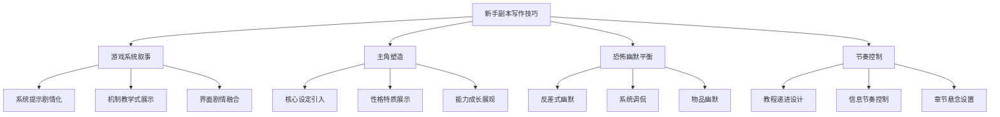

# 新手副本写作技巧分析

> **分析对象**：《惊悚乐园》新手副本（第001-003章）
> **分析重点**：核心写作技巧提炼、文风特色、写作手法
> **分析目的**：深入理解《惊悚乐园》新手副本的写作技巧和文风特点
> **分析时间**：2026年2月25日
> **数据来源**：新手副本第001-003章原文内容

## 一、核心写作技巧提炼

### 1.1 游戏系统自然叙事技巧

#### 技巧1：系统提示的剧情化处理
**原文示例**（第001章）：
```
【欢迎您使用本公司的产品，扫描已开始，请稍等。】
【扫描已完成，确认公民ID：SH13***313，姓名：封不觉...】
```

**技巧分析**：
- **功能融合**：系统提示不仅是功能说明，更是世界观引入工具
- **节奏控制**：通过系统提示控制信息释放节奏，避免信息过载
- **身份建立**：在第一章就建立主角的现实身份和游戏身份
- **自然过渡**：提示后立即衔接角色反应，形成"提示→反应"的流畅叙事链

**技巧详解**：
1. **提示时机**：在角色需要信息或行动指导时自然出现提示
2. **内容设计**：提示内容包含世界观信息、角色信息、操作指导
3. **反应衔接**：每次系统提示后都有角色的人性化反应，避免机械感
4. **风格统一**：提示语言风格与游戏公司人设一致（梦公司的谨慎风格）

#### 技巧2：游戏机制的教学式展示
**原文示例**（第002章）：
```
【这是您的生存值，以百分比显示，具体数值不可见...】
【这是您的体能值，具体数值可见...】
【这是您的惊吓值，以百分比显示，无具体数值...】
```

**技巧分析**：
- **渐进教学**：在新手教程中逐步解锁和讲解游戏机制
- **情境结合**：在玩家需要时展示对应机制（如遇到怪物时展示生存值）
- **重复强化**：关键机制多次出现，强化玩家记忆
- **实用导向**：每个机制都有明确的游戏内意义和影响

**技巧详解**：
1. **时机选择**：在机制首次影响游戏进程时进行讲解
2. **信息分层**：基础机制先讲解，复杂机制后引入
3. **示例配合**：讲解后立即提供实际应用示例
4. **自主空间**：教学同时保留玩家自主探索的空间

#### 技巧3：界面与剧情的无缝融合
**原文示例**（第002章）：
```
游戏菜单只会出现在玩家的视觉中，是无法照亮周围环境的...
此刻没有响起系统语音，不过封不觉在菜单中看到了文字提示...
```

**技巧分析**：
- **现实合理性**：解释游戏界面在故事中的存在形式
- **信息分层**：不同信息使用不同呈现方式（语音、文字、视觉）
- **沉浸保护**：确保游戏界面不破坏恐怖氛围和沉浸感
- **玩家特权**：强调某些信息只有玩家能看到，增强代入感

**技巧详解**：
1. **存在解释**：为游戏界面的存在提供合理的故事内解释
2. **功能限制**：明确界面的功能和限制，避免"万能界面"
3. **氛围协调**：界面设计考虑当前场景的氛围需求
4. **信息特权**：利用"玩家专属信息"创造叙事优势

### 1.2 主角塑造的"黄金三章"法则

#### 技巧4：核心设定的高效引入
**原文示例**（第001章）：
```
但封不觉，不是一般人...
首先，他玩这个游戏的初衷，是为了"治病"...
大约在两个月前，封不觉突然发现自身产生了某种异常...
他失去了"恐惧"这种情绪。
```

**技巧分析**：
- **悬念前置**：先抛出"不是一般人"的悬念，再逐步解释
- **动机合理**：游戏行为有深层心理动机（治病）
- **异常具体**：失去恐惧是具体可感知的异常，非模糊设定
- **医学背书**：通过医院检查增加设定的真实感和严肃性

**技巧详解**：
1. **悬念设计**：在解释前先制造悬念，吸引读者兴趣
2. **动机层次**：表面动机（玩游戏）与深层动机（治病）结合
3. **异常具体化**：异常设定要具体、可感知、可验证
4. **科学背书**：通过医学检查等科学手段增加设定可信度

#### 技巧5：性格特质的细节展示
**原文示例**（第001章）：
```
封不觉的古怪之处很多...这里先说一个：阅读癖...
他对于阅读的渴望是常人难以理解的...
只要某件东西或某个人会跟封不觉产生利害关系，他就会本能地收集与其相关的一切信息。
```

**技巧分析**：
- **典型细节**：选择最能体现性格的细节（阅读癖）
- **极端表现**：将特质推向极端，增强记忆点
- **功能关联**：性格特质与角色能力直接相关（信息收集）
- **多层展示**：通过多个小例子全面展示特质

**技巧详解**：
1. **特质选择**：选择能推动剧情、展现性格的核心特质
2. **极端化处理**：将普通特质极端化，形成角色特色
3. **功能结合**：特质要有实际的剧情功能和游戏优势
4. **多例展示**：通过多个生活细节全面展示特质表现

#### 技巧6：能力成长的合理展现
**原文示例**（第002-003章）：
```
第002章：封不觉在恐怖环境中保持冷静分析
第003章：封不觉冷静挥剑斩杀血尸，查看装备属性
```

**技巧分析**：
- **能力一致性**：冷静分析能力在探索和战斗中都体现
- **情境验证**：能力在关键时刻得到验证和展示
- **成长可见**：从分析环境到实际战斗的能力递进
- **自我认知**：角色对自己的能力有清晰认知和运用

**技巧详解**：
1. **能力展示**：通过具体行为而非旁白描述展示能力
2. **情境测试**：设计能验证和展示能力的特定情境
3. **成长轨迹**：展示能力从认知到实践的过程
4. **自我意识**：角色对自己能力的认知和运用意识

### 1.3 恐怖氛围与幽默的平衡艺术

#### 技巧7：反差式幽默插入
**原文示例**（第002章）：
```
正常人恐怕还没等电梯门完全打开，就侧身冲出去撒丫子开跑了。
封不觉却不着急，对他来说，眼前这条幽幽之道，未必就比这个电梯安全。
```

**技巧分析**：
- **预期反差**：主角反应与常人预期形成鲜明对比
- **逻辑合理**：反差有合理的内部逻辑（分析安全性）
- **节奏调节**：在紧张时刻插入幽默，调节叙事节奏
- **角色塑造**：通过反差展现角色独特性格

**技巧详解**：
1. **预期建立**：先建立常人预期反应，再展示主角反差
2. **逻辑支撑**：反差行为要有合理的角色内在逻辑
3. **时机把握**：在恐怖场景中适时插入反差幽默
4. **双重功能**：反差既提供幽默，又推进角色塑造

#### 技巧8：系统调侃的幽默运用
**原文示例**（第001章）：
```
"嗯……和其他游戏的协议差不多嘛。"封不觉花了两分钟就把那好几千字的条款给看完了...
```

**技巧分析**：
- **日常共鸣**：调侃玩家熟悉的游戏体验
- **性格展示**：通过调侃内容展现角色性格（阅读速度快）
- **氛围调节**：在严肃的系统协议中插入轻松调侃
- **信息传递**：调侃同时传递重要信息（协议内容）

**技巧详解**：
1. **共鸣点选择**：选择玩家熟悉的游戏元素进行调侃
2. **性格融入**：调侃方式要符合角色性格特点
3. **氛围调节**：利用调侃调节严肃氛围，避免沉闷
4. **信息传递**：调侃同时完成必要的信息传递

#### 技巧9：物品描述的幽默设计
**原文示例**（第003章）：
```
【名称：石头】
【类型：武器】
【品质：垃圾】
【备注：随处可见、形状不规则的石块，有时会被拾起来当武器使用，虽然可以自由带出或带入任何剧本，但人们总是用完就扔，根本不会装进行囊或者一直拿着。】
```

**技巧分析**：
- **属性反差**：垃圾品质与详细描述的幽默反差
- **现实调侃**：对玩家游戏行为的现实调侃
- **世界观扩展**：通过备注扩展游戏世界观细节
- **风格统一**：幽默风格与整体叙事风格一致

**技巧详解**：
1. **反差设计**：利用物品属性与描述的落差创造幽默
2. **现实映射**：调侃玩家在游戏中的常见行为
3. **世界观融合**：通过物品备注扩展世界观细节
4. **风格控制**：幽默要符合整体叙事风格和当前氛围

### 1.4 节奏控制的实用方法

#### 技巧10：新手教程的递进式设计
**结构分析**：
```
第001章：系统引入、角色建立、游戏开始
第002章：基础教学、恐怖体验、简单解谜
第003章：战斗体验、奖励结算、能力成长
```

**技巧分析**：
- **难度递进**：从认知→体验→实践的逐步升级
- **目标明确**：每章有明确的阶段目标
- **成就感设计**：每章结束时有明确的进展或收获
- **留白艺术**：教学同时保留探索空间

**技巧详解**：
1. **阶段划分**：将教程分解为逻辑递进的多个阶段
2. **目标设计**：每个阶段有明确的可完成目标
3. **收获设置**：每个阶段结束时有明确的成就感来源
4. **探索保留**：在教学框架内保留自主探索空间

#### 技巧11：信息释放的节奏控制
**原文示例**（第001章信息释放顺序）：
1. 游戏系统基础信息
2. 主角现实身份和异常
3. 游戏动机和背景
4. 游戏内行动开始

**技巧分析**：
- **先主后次**：核心信息优先释放
- **间隔缓冲**：重要信息间有缓冲内容
- **重复强化**：关键信息通过多种方式重复
- **悬念保留**：保留部分信息制造悬念

**技巧详解**：
1. **优先级排序**：按理解必要性排序信息释放顺序
2. **缓冲设计**：在重要信息间设计缓冲内容
3. **强化策略**：关键信息通过不同方式重复出现
4. **悬念保留**：主动保留部分信息制造阅读动力

#### 技巧12：章节结尾的悬念设置
**原文示例**（第001章结尾）：
```
话音刚落，电梯间毫无征兆猛然一震。随后，这个伸手不见五指的黑匣子就动了起来，缓缓向下方沉去。
```

**技巧分析**：
- **动作悬念**：通过突然的动作变化制造悬念
- **感官描述**：强调感官体验增强悬念感
- **方向暗示**：向下移动暗示进入更深处/危险
- **节奏转折**：在相对平静后突然转折

**技巧详解**：
1. **悬念类型**：动作、发现、对话、环境变化等多种悬念形式
2. **感官强化**：通过感官描述增强悬念的沉浸感
3. **方向暗示**：悬念要暗示后续发展方向
4. **节奏转折**：在相对平静处设置转折，增强冲击力

## 二、文风特色分析

### 2.1 语言风格特点

#### 简洁明快的叙述风格
**特点分析**：
- **短句为主**：避免冗长复杂的句子结构
- **动词驱动**：使用主动语态和具体动词推动叙述
- **信息密集**：在简洁语言中包含丰富信息
- **节奏感强**：通过句式变化控制阅读节奏

**示例分析**（第001章）：
> "听完了倒计时，封不觉很快便进入了游戏的世界中。他置身在一个和电梯十分相像的环境里，但门的旁边没有楼层按钮。"

#### 系统语言的格式化风格
**特点分析**：
- **格式统一**：系统提示使用【】框起，格式统一
- **语言正式**：系统语言正式、简洁、无冗余
- **功能明确**：每个提示都有明确的功能目的
- **风格对比**：系统语言与角色语言的风格对比

**示例分析**（第001章）：
> 【欢迎您使用本公司的产品，扫描已开始，请稍等。】
> 【扫描已完成，确认公民ID：SH13***313，姓名：封不觉...】

#### 内心独白的口语化风格
**特点分析**：
- **口语化表达**：使用日常口语表达方式
- **性格体现**：独白语言体现角色性格特点
- **信息补充**：通过独白补充叙事信息
- **节奏调节**：独白调节叙述节奏和视角

**示例分析**（第001章）：
> "一共就一个选项，还搞了这么个登陆空间出来……这家公司是在暗示今后还会推出很多游戏吗……"

### 2.2 视角运用技巧

#### 第三人称有限视角的运用
**技巧分析**：
- **视角一致**：始终以封不觉的视角展开叙述
- **信息限制**：只展示封不觉能感知的信息
- **内心可见**：展示封不觉的内心活动和思考
- **外部观察**：通过封不觉的观察展示外部世界

**效果分析**：
1. **增强代入感**：读者通过封不觉的视角体验故事
2. **控制信息流**：通过视角限制控制信息释放
3. **角色聚焦**：始终聚焦主角的体验和成长
4. **悬念制造**：利用视角限制制造悬念和惊喜

#### 系统提示的视角切换
**技巧分析**：
- **视角补充**：系统提示提供主角无法直接感知的信息
- **权威声音**：系统作为客观权威的信息来源
- **风格对比**：系统语言与角色语言的风格对比
- **功能明确**：每次视角切换都有明确的功能目的

**效果分析**：
1. **信息补充**：补充主角视角无法提供的信息
2. **权威建立**：建立游戏系统的权威性和可信度
3. **风格丰富**：增加叙事语言的风格层次
4. **节奏变化**：通过视角切换调节叙事节奏

### 2.3 恐怖氛围营造技巧

#### 环境描写的感官化
**技巧分析**：
- **多感官描写**：视觉、听觉、嗅觉、触觉综合运用
- **细节选择**：选择最能营造恐怖感的细节
- **对比强化**：安全环境与恐怖环境的对比
- **渐进强化**：恐怖程度逐步提升

**示例分析**（第002章）：
> "外面是一条笔直的走廊，天花板是木质的，两侧的墙上都贴着墙纸，墙纸上的花纹图案颇为诡异，像人的眼睛；地板上铺着绿色的地毯，走廊两侧一扇窗户都没有，也没有房门，只是每隔一段距离，便有一盏灯光昏黄的壁灯。"

#### 心理恐怖的间接营造
**技巧分析**：
- **预期营造**：通过描述常人预期反应营造恐怖
- **未知恐惧**：利用未知和不可见增强恐怖
- **细节暗示**：通过细节暗示潜在威胁
- **节奏控制**：通过节奏变化控制恐怖强度

**示例分析**（第002章）：
> "正常人恐怕还没等电梯门完全打开，就侧身冲出去撒丫子开跑了。"
> → 通过描述常人预期反应，间接营造恐怖氛围

#### 突然惊吓的节奏控制
**技巧分析**：
- **平静铺垫**：在惊吓前营造相对平静的氛围
- **突然转折**：通过突然事件打破平静
- **感官冲击**：强调突然事件的感官冲击力
- **后续影响**：展示惊吓的后续影响和反应

**示例分析**（第001章结尾）：
> 相对平静的对话后突然：
> "话音刚落，电梯间毫无征兆猛然一震。"

## 三、技巧应用总结

### 3.1 新手副本技巧体系

#### 技巧体系框架


#### 技巧关联性分析
1. **系统与角色互动**：系统提示与角色反应形成叙事链
2. **恐怖与幽默互补**：恐怖氛围与幽默元素相互调节
3. **节奏与信息协调**：信息释放节奏与叙事节奏协调
4. **设定与行为一致**：角色设定与行为表现逻辑一致

### 3.2 技巧的可迁移性

#### 可迁移到其他游戏小说的技巧
1. **系统叙事融合**：任何游戏小说都需要处理系统与叙事的关系
2. **角色异常设定**：独特主角设定是游戏小说的常见需求
3. **氛围节奏控制**：恐怖、紧张等氛围的营造技巧
4. **幽默平衡艺术**：在严肃题材中插入幽默的技巧

#### 《惊悚乐园》特有的技巧
1. **恐怖游戏特色**：针对恐怖游戏的特殊氛围营造
2. **封不觉式主角**：特定性格和能力组合的主角塑造
3. **系统调侃风格**：特定的系统与玩家互动幽默风格
4. **新手教程设计**：针对新手引导的特殊叙事结构

### 3.3 技巧的进阶应用

#### 从新手副本到后续章节的技巧演进
1. **系统复杂度增加**：从基础系统到复杂系统的渐进引入
2. **角色深度拓展**：从基础设定到复杂性格的深度挖掘
3. **恐怖层次丰富**：从直接恐怖到心理恐怖的多层次营造
4. **幽默类型多样**：从简单调侃到复杂Meta幽默的类型扩展

#### 特别篇中的技巧深化
1. **Meta叙事引入**：在后续特别篇中引入更复杂的Meta叙事
2. **多角色互动**：从主角独白到多角色复杂互动
3. **结构创新**：从线性教程到复杂剧本结构
4. **主题深化**：从单纯恐怖到存在主义等深层主题

## 四、分析总结

### 4.1 新手副本的成功要素

#### 结构设计的成功
1. **三章完整闭环**：在有限篇幅内完成完整的新手体验
2. **目标明确递进**：每章有明确目标，整体递进清晰
3. **收获感强烈**：每章结束时有明确的成就感和成长感
4. **悬念驱动连续**：章节间悬念有效驱动连续阅读

#### 角色塑造的成功
1. **高效设定引入**：三章内建立完整且有特色的主角设定
2. **行为性格一致**：角色行为始终符合设定性格
3. **能力展示合理**：能力通过具体情境合理展示
4. **成长轨迹清晰**：从新手到初步掌握游戏的成长轨迹

#### 风格确立的成功
1. **独特风格快速确立**：三章内确立作品独特风格
2. **平衡把握精准**：恐怖与幽默的平衡把握准确
3. **读者预期管理**：有效建立读者对后续内容的预期
4. **核心趣味明确**：明确展示作品的核心趣味点

### 4.2 对写作学习的启示

#### 对于新手作者的启示
1. **结构重于细节**：先掌握整体结构，再完善细节
2. **特色需要强化**：角色特色和风格特色需要强化而非弱化
3. **节奏需要设计**：叙事节奏需要主动设计而非随意
4. **反馈需要关注**：通过读者反馈验证技巧应用效果

#### 对于进阶作者的启示
1. **技巧可以分解**：复杂技巧可以分解为多个简单技巧
2. **风格可以分析**：独特风格可以分析为具体技巧组合
3. **效果可以预测**：技巧应用效果可以通过分析预测
4. **创新可以学习**：写作创新可以通过技巧分析学习

### 4.3 后续学习方向

#### 深入分析方向
1. **后续章节分析**：分析新手副本后的章节技巧演进
2. **特别篇对比分析**：分析特别篇与主线的技巧差异
3. **读者反应分析**：分析读者对技巧应用的实际反应
4. **市场定位分析**：分析技巧与市场定位的关系

#### 实践应用方向
1. **模仿练习**：通过模仿练习掌握基础技巧
2. **变体练习**：通过变体练习掌握技巧灵活应用
3. **创新尝试**：在掌握基础后尝试技巧创新
4. **教学分享**：通过教学分享深化技巧理解

---

**文档版本**：1.0（独立版）
**创建时间**：2026年2月25日
**原始来源**：基于《惊悚乐园》新手副本第001-003章分析
**关联文档**：《惊悚乐园》同人创作指南.md

> **使用说明**：本文档专注于写作技巧的分析和提炼，适合希望深入理解《惊悚乐园》写作技巧的作者和研究者使用。建议结合原文阅读，通过具体例子理解抽象技巧。