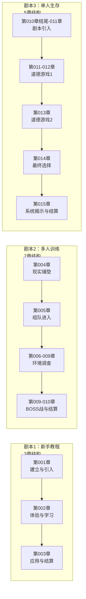

# 《惊悚乐园》新手剧本叙事结构分析

> **文档定位**：结构层知识蒸馏
> **分析对象**：新手剧本1-3（第001-015章）
> **文档目标**：提炼叙事架构规律，提供可复用的结构设计参考
> **关联文档**：01-新手剧本123剧情梗概与写作指南.md、03-写作技巧手册.md

---

## 一、三个剧本的宏观架构对比

### 1.1 基本信息速览

| 剧本 | 章节数 | 游戏模式 | 核心功能 | 教学重点 |
|------|--------|----------|----------|----------|
| **剧本1** | 3章 | 新手教程（单人） | 建立主角设定+基础机制教学 | 生存/体能/惊吓/技巧值、物品系统 |
| **剧本2** | 7章 | 多人训练模式 | 引入配角+团队协作机制 | 多人规则、社交系统、战斗配合 |
| **剧本3** | 5章 | 单人生存模式（普通） | 独立解谜+道德选择+长期机制铺垫 | 支线任务、世界观破解、拼图牌系统 |

### 1.2 结构模式对比



---

## 二、剧本递进关系分析

### 2.1 认知阶段 → 体验阶段 → 实践阶段

| 阶段 | 剧本 | 玩家状态 | 叙事策略 |
|------|------|----------|----------|
| **认知阶段** | 剧本1 | 完全陌生 | 强制线性引导，逐步展示机制 |
| **体验阶段** | 剧本2 | 初步了解 | 提供安全环境（训练模式），允许探索 |
| **实践阶段** | 剧本3 | 准备就绪 | 独立面对挑战，引入复杂元素（道德选择） |

### 2.2 递进逻辑的关键设计

**剧本1→剧本2的过渡**：
- 现实铺垫（第004章）：展示封不觉的日常生活、写作状态、与王叹之的关系
- 组队动机自然：王叹之完成教程后约封不觉一起游戏
- 等级差距处理：解释为何不一上来就组队（避免进程脱节）

**剧本2→剧本3的过渡**：
- 结算后的战略分析（第009章后半）：解释为何需要分开提升
- 装备和专精的短板意识：为单人生存模式的收获做铺垫
- 社交系统介绍（第010章）：为后续团队生存模式做准备

---

## 三、分剧本章节功能详解

### 3.1 剧本1：新手教程结构分析

| 章节 | 功能定位 | 核心任务 | 关键转折点 |
|------|----------|----------|------------|
| **第001章** | 建立与引入 | ①角色异常设定（失去恐惧）<br/>②阅读癖性格展示<br/>③昵称创建 | 电梯下沉前的恐怖预告："欢迎来到惊悚乐园……" |
| **第002章** | 体验与学习 | ①恐怖氛围体验<br/>②核心机制教学（四值系统）<br/>③解谜初体验 | 从逃跑转为反击的关键道具发现（血尸必须死） |
| **第003章** | 应用与结算 | ①战斗机制实践<br/>②奖励结算<br/>③后续系统解锁（行囊、专精） | 石头奖励的幽默反转 |

**节奏控制特点**：
- 第001章前半偏静态（阅读协议、创建角色），后半突然加速（电梯变黑、下沉）
- 第002章持续紧张（追逐战），但穿插冷静分析缓冲
- 第003章战斗→结算的明快转换

### 3.2 剧本2：多人训练结构分析

| 章节 | 功能定位 | 核心任务 | 关键转折点 |
|------|----------|----------|------------|
| **第004章** | 现实铺垫 | ①封不觉生活状态<br/>②王叹之角色建立<br/>③组队动机 | — |
| **第005章** | 组队进入 | ①多人规则教学<br/>②防骚扰机制<br/>③初始恐怖事件 | 血手印出现、黑影闪过转角 |
| **第006章** | 调查展开 | ①第一间房搜索<br/>②病历与素描发现<br/>③解谜路线选择 | 封不觉提出"两种选择" |
| **第007章** | 解谜深入 | ①第二间房保险箱<br/>②技能卡获得<br/>③第三间房开启 | 爆炸神拳技能获取 |
| **第008章** | 真相揭示 | ①笔记本阅读<br/>②BOSS机制分析<br/>③弱点发现 | 推断出"害怕阳光" |
| **第009章** | BOSS战 | ①战斗过程<br/>②团队协作展示<br/>③经验结算分析 | 封不觉飞扑救场 |
| **第010章** | 结算与过渡 | ①社交系统介绍<br/>②单人生存模式铺垫<br/>③队伍解散 | 竖锯风格剧本引入 |

**节奏控制特点**：
- 第004章完全脱离游戏，纯现实铺垫（独特的缓冲设计）
- 第005-008章调查阶段张弛交替（恐怖事件→冷静解谜→恐怖升级→推理）
- 第009章高潮战斗，第010章平缓过渡

### 3.3 剧本3：单人生存结构分析

| 章节 | 功能定位 | 核心任务 | 关键转折点 |
|------|----------|----------|------------|
| **第010章结尾** | 剧本引入 | ①单人生存模式选择<br/>②剧本简介播放 | — |
| **第011章** | 竖锯引入 | ①角色背景设定（亚瑟·席格）<br/>②第一个道德游戏设置 | 玩偶录音播放完毕 |
| **第012章** | 道德游戏1 | ①不杀猴解谜<br/>②灯管重量计算<br/>③黑暗中的操作 | 门开启，成功不牺牲动物 |
| **第013章** | 道德游戏2 | ①冷冻室环境<br/>②报纸折盒解谜<br/>③FM频率密码 | 发现FM27.3MHz频率 |
| **第014章** | 最终选择 | ①钥匙抉择（自救vs救友）<br/>②话术陷阱破解 | 发现"离开"≠"生还"的文字游戏 |
| **第015章** | 系统揭示 | ①拼图牌系统揭示<br/>②客服对话解释<br/>③技能获取 | 新技能"坑爹"反转 |

**节奏控制特点**：
- 纯游戏内叙事，无现实穿插
- 时间压力贯穿（40分钟毒素倒计时）
- 三个游戏房间难度递增（物理解谜→环境解谜→道德陷阱）
- 第014章心理层面的高潮（非战斗）

---

## 四、关键叙事技巧分析

### 4.1 悬念设置点分布

| 位置 | 悬念内容 | 释放时机 | 效果 |
|------|----------|----------|------|
| 第001章结尾 | 电梯下沉，恐怖预告 | 第002章开头 | 维持紧张感跨章节 |
| 第002章中段 | 血尸追击能否逃脱 | 发现钥匙图案 | 给予解谜成就感 |
| 第005章 | 黑影是什么 | 第008章揭示 | 3章的持续悬念 |
| 第011章 | 能否不杀猴子过关 | 第012章解决 | 道德困境的解脱感 |
| 第014章 | 王叹之是否真的在另一个剧本 | 第015章（遗留疑问） | 开放式悬念 |

### 4.2 张弛曲线特征

**剧本1**：
```
紧张 ↑  静态建立 → 电梯下沉 → 恐怖追逐 → 战斗解决 → 结算放松
```

**剧本2**：
```
紧张 ↑  现实铺垫 → 组队进入 → 血手印惊吓 → 调查缓冲 → 笔记本紧张 → BOSS战高潮 → 结算放松
```

**剧本3**：
```
紧张 ↑  剧本引入 → 道德压力 → 解谜操作 → 环境压力（冷冻）→ 心理抉择 → 系统揭示
```

### 4.3 章节结尾钩子设计

| 章节 | 结尾钩子 | 功能 |
|------|----------|------|
| 第001章 | 电梯下沉，恐怖语音 | 强制翻页 |
| 第002章 | 血尸加速追击，巨剑出现 | 战斗期待 |
| 第004章 | 两人准备上线开打 | 组队期待 |
| 第005章 | 血手印+黑影 | 探索期待 |
| 第008章 | 推断出BOSS弱点，前往决战 | 战斗期待 |
| 第010章 | 竖锯录音开始 | 新模式期待 |
| 第011章 | 道德游戏设置完毕 | 解谜期待 |
| 第013章 | 还剩15分钟，前往最终游戏 | 时间压力 |
| 第014章 | 发现文字游戏，完成剧本 | 智力满足感 |

---

## 五、可复用的结构设计要点

### 5.1 新手教程黄金结构（3章）

```
第1章：建立与引入
├─ 角色核心设定展示（异常点）
├─ 世界观基础铺垫
└─ 悬念结尾（进入核心场景）

第2章：体验与学习
├─ 核心机制自然融入（在需要时出现）
├─ 轻度挑战（让玩家有成就感但不挫败）
└─ 获得关键能力/道具

第3章：应用与结算
├─ 综合应用所学
├─ 胜利完成
└─ 奖励+新系统解锁（为下一循环铺垫）
```

### 5.2 多人模式结构设计要点

1. **现实铺垫章**：建立角色关系，解释组队动机
2. **规则教学**：在组队后、进本前完成，不中断叙事
3. **分工设计**：让每个角色有独特价值（封不觉推理、王叹之医疗）
4. **共同成长**：结算时分析差距，为后续提升铺垫

### 5.3 道德选择场景设计要点

1. **两难设置**：两个选项都有合理性
2. **隐性第三选项**：不选A也不选B，找到C（如剧本3的不杀猴解谜）
3. **后果延迟**：选择的影响不立即显现，增加决策重量
4. **话术陷阱**：用文字游戏增加解谜层次（如"离开"vs"生还"）

---

## 六、原文支撑摘录

### 6.1 剧本1关键原文

**悬念设置（第001章结尾）**：
> "话音刚落，电梯间毫无征兆猛然一震。随后，这个伸手不见五指的黑匣子就动了起来，缓缓向下方沉去。"

**机制自然融入（第002章）**：
> "这时血尸正好走出电梯，立刻气势十足地咆哮一声，挥手朝走廊的一面墙捶了一下，墙纸后厚实的木板被瞬间击碎……'算你狠。'封不觉见到这一幕扭头就跑。"

**幽默反转（第003章）**：
> "选定后，玻璃柱中亮起白光，随后出现了……一块石头。"
> "空旷的房间中，回响起封不觉的呐喊：'坑爹呢这是！'"

### 6.2 剧本2关键原文

**角色分工（第006章）**：
> "'这个是你本行。'封不觉说着，又扬了扬自己手上剩余的一叠纸：'这一堆由我来看。'"

**推理展示（第008章）**：
> "'1月10日，意念移物；1月16日，人格变异……'封不觉冷静到冷酷地分析着：'而关于他弱点的提示，在1月26日那段，以及我们目前为止的所见到的状况。'他顿了一下：'他害怕阳光。'"

### 6.3 剧本3关键原文

**道德困境设置（第011章）**：
> "'你把那些偷猎者贬得一文不值……但你亲眼目睹那些动物被杀，却只是冷漠地旁观。现在，你有机会体会到真正的刽子手是什么感觉了。是否用这个动物的生命，来换取自己的生存，做出选择吧，亚瑟。'"

**话术陷阱揭示（第014章）**：
> "'你说我'可以用它打开最后的一扇门'，但并没说过打开以后就可以活，我只会'离开'而已。'封不觉道：'而最关键的提示就是……'卑鄙伪善的亚瑟·席格选择死去，善良正直的约翰就可生还'这句话。'"

---

## 七、总结与应用建议

### 7.1 核心结构规律

1. **三幕式微观应用**：每个剧本都是完整的三幕式结构（建立-对抗-解决）
2. **教学嵌入叙事**：机制教学不是旁白，而是玩家行动的自然结果
3. **悬念跨章维持**：每章结尾都有明确的翻页动机
4. **递进式难度**：从线性引导→开放探索→复杂选择

### 7.2 创作应用建议

1. **设计章节功能**：先确定每章的核心任务，再填充内容
2. **控制信息释放**：关键信息分阶段给出，避免一次性暴露
3. **预留缓冲空间**：高强度恐怖/紧张后，安排解谜或对话缓冲
4. **设置隐性选项**：道德困境设计时，考虑"不选A也不选B"的创造性解法

---

**文档版本**：1.0
**创建时间**：2026年3月4日
**关联文档**：
- 01-新手剧本123剧情梗概与写作指南.md（基础梗概）
- 03-写作技巧手册.md（技法层蒸馏）
- 04-原文摘录库.md（文本层蒸馏）