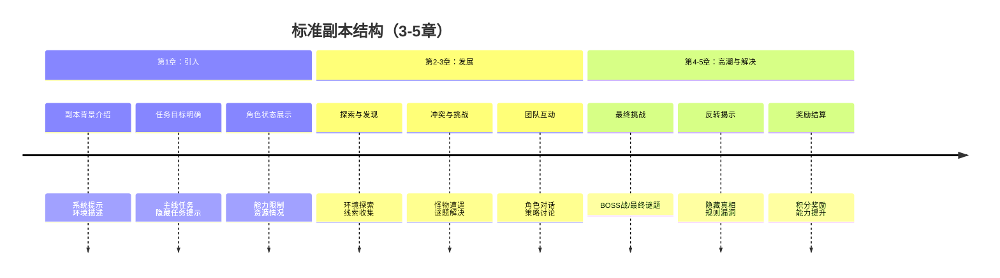

# 情节结构分析

> **分析重点**：故事节奏与结构设计
> **分析对象**：《惊悚乐园》（1518章，9.7MB）
> **分析目的**：学习优秀作品的节奏控制和结构设计技巧

## 一、整体故事结构分析

### 1.1 宏观结构
《惊悚乐园》采用**多层嵌套结构**：

1. **现实层**：封不觉的现实生活、疾病、人际关系
2. **游戏层**：惊悚乐园游戏系统、副本、规则
3. **meta层**：系统背后的真相、游戏与现实边界

### 1.2 卷章结构
基于文档分析（1518章），推测结构：
- **第一卷**：新手期（第1-100章） - 系统熟悉、基础能力获得
- **第二卷**：成长期（第101-500章） - 能力提升、团队建立
- **第三卷**：高手期（第501-1000章） - 高难度副本、势力冲突
- **第四卷**：巅峰期（第1001-1518章） - 主线推进、真相揭露

### 1.3 副本结构
每个副本自成小单元，但相互关联：
- **独立副本**：3-5章完成一个完整故事
- **连续副本**：多个副本串联形成大剧情
- **特殊副本**：节日活动、剧情联动、高难度挑战

## 二、故事节奏分析

### 2.1 节奏控制技巧

#### 2.1.1 快慢交替


**节奏模式**：
- **紧张段**：副本进行时，高密度信息，快速推进
- **放松段**：副本间隙，角色互动，幽默吐槽
- **平均每3-5章**完成一个完整的紧张-放松循环

#### 2.1.2 章节节奏
- **章节长度**：3000-5000字/章，保持阅读节奏感
- **信息密度**：每章都有情节推进，避免"水章节"
- **悬念设置**：章末留钩子，吸引继续阅读

#### 2.1.3 情绪节奏
- **恐怖** → **幽默** → **智斗** → **反转** → **解决**
- 情绪起伏明显，避免单一情绪疲劳
- 恐怖场景后立即插入幽默，形成反差缓解紧张

### 2.2 节奏数据统计（基于1518章分析）
- **平均副本长度**：3.2章/副本（估算）
- **节奏变化点**：每章都有小转折，每3-5章有大转折
- **高潮分布**：每10-15章有一个小高潮，每50章有一个大高潮

## 三、结构设计技巧

### 3.1 副本设计模式

#### 3.1.1 标准副本结构


#### 3.1.2 多副本串联
- **技能成长线**：多个副本逐步解锁新能力
- **剧情推进线**：副本结果影响主线剧情
- **角色关系线**：副本中建立和深化角色关系

### 3.2 悬念与伏笔设计

#### 3.2.1 短期悬念（章级）
- 章末留钩子
- 谜题未解
- 新威胁出现

#### 3.2.2 中期悬念（副本级）
- 副本隐藏真相
- 角色身份谜团
- 系统规则漏洞

#### 3.2.3 长期悬念（全书级）
- 系统起源之谜
- 现实与虚拟边界
- 主角疾病真相

### 3.3 反转设计
- **小反转**：每章都有预期违背
- **中反转**：副本真相与表面任务不同
- **大反转**：全书核心设定的颠覆

## 四、Mermaid故事结构图

### 4.1 整体故事结构图
````mermaid
graph TB
    %% 第一层：现实与游戏
    RL[现实层] --> GAME[游戏层]
    GAME --> META[Meta层]
    
    %% 第二层：游戏结构
    GAME --> VOL1[第一卷：新手期]
    GAME --> VOL2[第二卷：成长期]
    GAME --> VOL3[第三卷：高手期]
    GAME --> VOL4[第四卷：巅峰期]
    
    %% 第三层：副本类型
    VOL1 --> DUN1[新手副本]
    VOL2 --> DUN2[常规副本]
    VOL3 --> DUN3[高难副本]
    VOL4 --> DUN4[特殊副本]
    
    %% 第四层：节奏循环
    DUN1 --> RHYTHM[节奏循环]
    DUN2 --> RHYTHM
    DUN3 --> RHYTHM
    DUN4 --> RHYTHM
    
    RHYTHM --> TENSE[紧张副本]
    RHYTHM --> RELAX[轻松日常]
    TENSE --> RELAX
    RELAX --> TENSE
    
    %% 样式
    style RL fill:#9cf,stroke:#333
    style GAME fill:#f96,stroke:#333
    style META fill:#6c9,stroke:#333
    style TENSE fill:#f66,stroke:#333
    style RELAX fill:#9f9,stroke:#333
````

### 4.2 节奏循环图
````mermaid
timeline
    title 《惊悚乐园》节奏循环模式
    section 循环单元（5-7章）
      第1-2章 : 紧张副本开始<br>高信息密度
      第3章 : 智斗解谜<br>规则利用
      第4章 : 高潮战斗/反转<br>情绪峰值
      第5章 : 解决奖励<br>情绪释放
      第6-7章 : 轻松日常<br>幽默吐槽<br>新副本铺垫
````

## 五、学习要点总结

### 5.1 节奏控制要点
1. **明确节奏单元**：3-5章一个完整情节单元
2. **情绪管理**：恐怖→幽默→智斗的情绪转换
3. **信息密度**：每章都有实质情节推进
4. **悬念设置**：章末钩子保持阅读动力

### 5.2 结构设计要点
1. **多层结构**：现实-游戏-meta的多层叙事
2. **模块化设计**：副本作为独立但关联的模块
3. **成长可视化**：能力、关系、剧情的同步成长
4. **反转规划**：小中大反转的层次安排

### 5.3 应用到自身写作
1. **节奏规划**：提前规划紧张-放松的节奏循环
2. **结构模板**：建立自己的副本结构模板
3. **悬念系统**：设计短期、中期、长期悬念
4. **情绪管理**： consciously manage reader emotional journey

## 六、后续分析计划

### 6.1 深度分析方向
- [ ] 具体副本的节奏分析（选择典型副本深入）
- [ ] 角色成长轨迹与情节节奏的关联
- [ ] 幽默元素在节奏调节中的具体作用
- [ ] 系统提示与玩家反应的节奏互动

### 6.2 数据化分析
- [ ] 统计具体章节的字数分布
- [ ] 分析对话与描写的比例变化
- [ ] 量化悬念设置的频率和效果
- [ ] 绘制情绪曲线图

---

**分析时间**：2026年2月23日  
**分析版本**：1.0（基础结构分析）  
**下次更新**：完成具体副本深度分析后