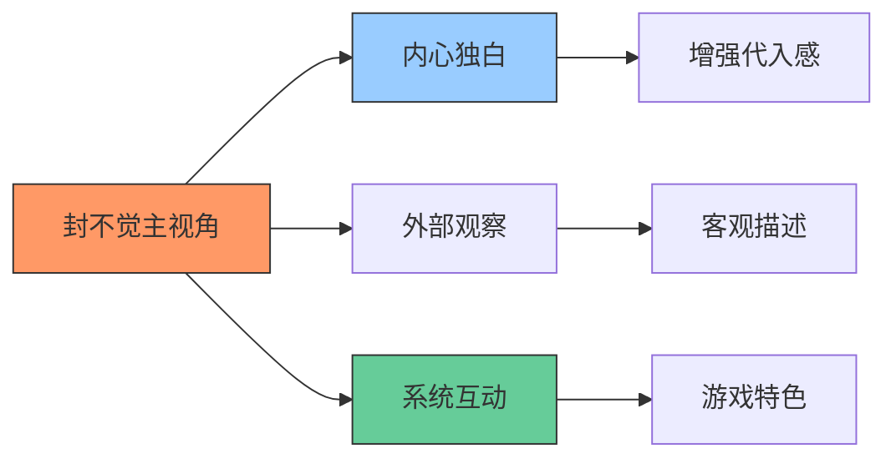
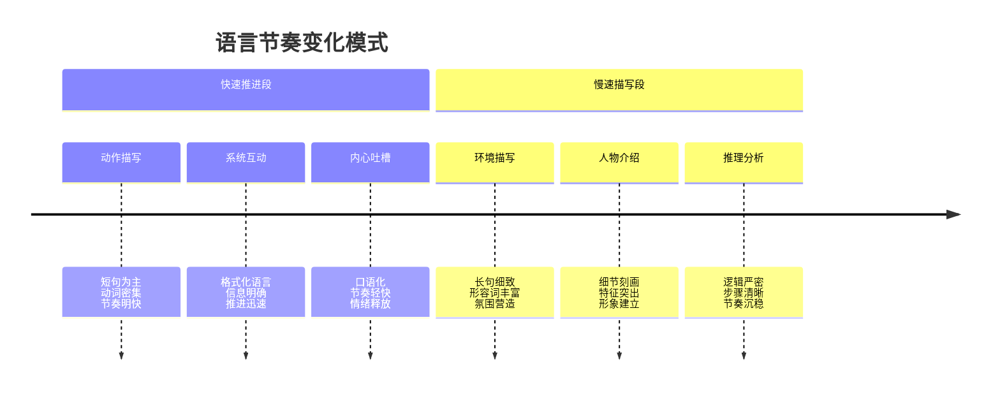
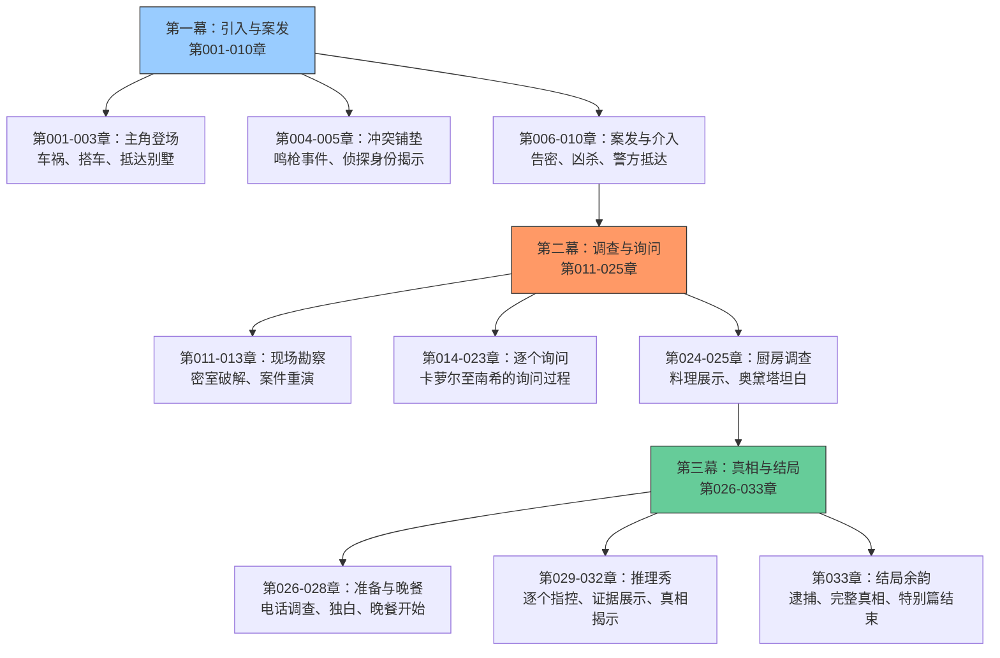
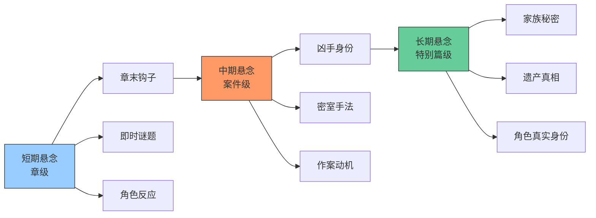
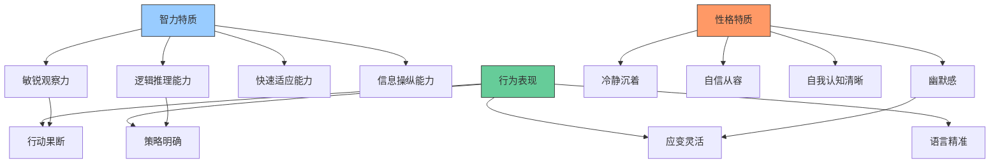
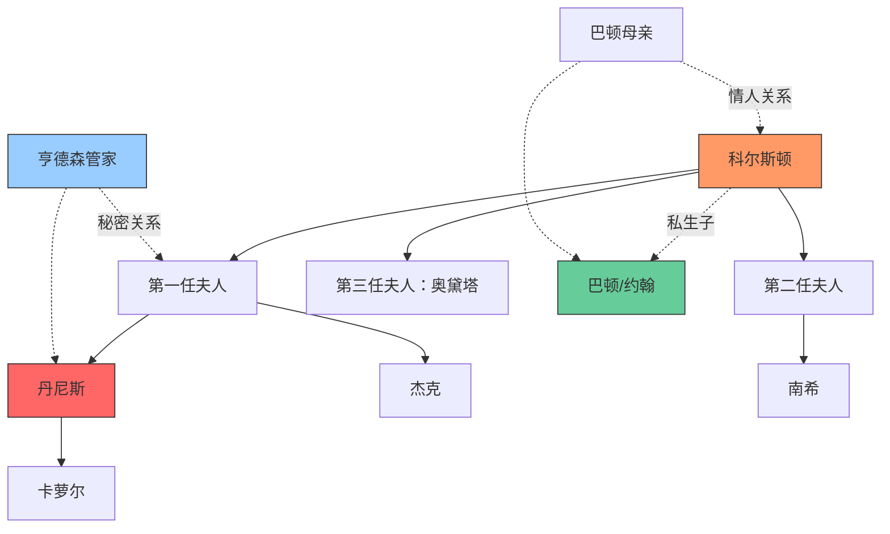
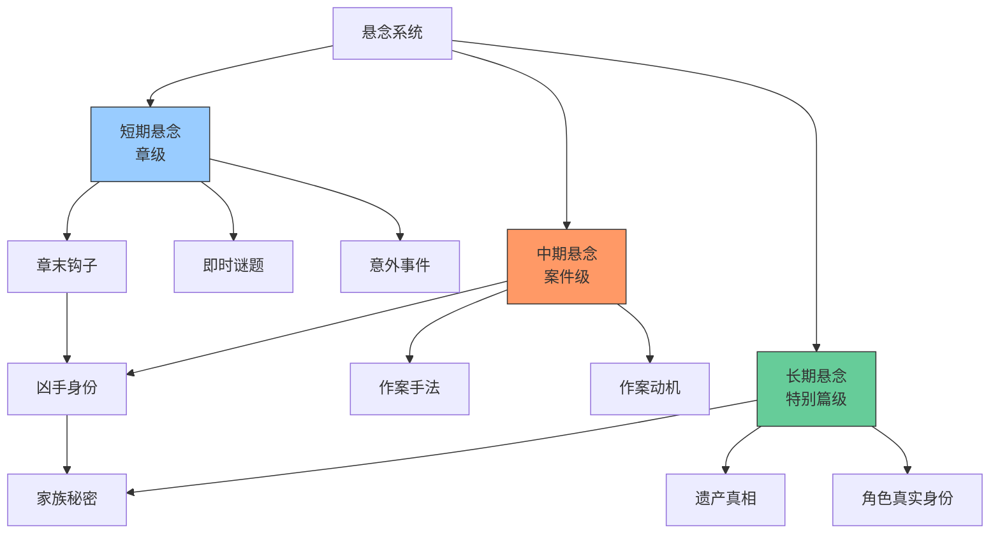
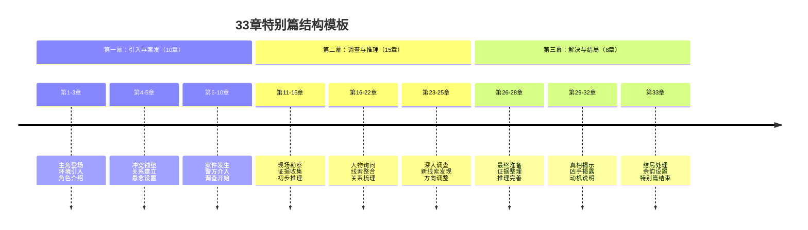

# 《惊悚乐园》特别篇Ⅰ 侦探 - 完整分析

> **分析对象**：《惊悚乐园》特别篇Ⅰ 侦探（第001-033章）
> **分析重点**：文风特色、情节构成、幽默桥段、写作技巧
> **分析目的**：提炼可借鉴的创作技巧，提升自身作品质量
> **分析时间**：2026年2月25日

## 一、文档概述

### 1.1 特别篇基本信息
- **篇幅**：33章完整故事
- **类型**：游戏内剧本、密室推理、家族秘密
- **时间设定**：1985年，虚构欧洲小国亚萨利
- **地点设定**：洛夫克拉夫特家族山中别墅
- **核心设定**：玩家能力被限制，以普通人身份参与推理

### 1.2 分析框架
本分析将从文风、情节、幽默、角色、技巧五个维度展开，深入剖析特别篇的成功要素和可借鉴之处。

## 二、文风特色深度分析

### 2.1 叙述视角与风格

#### 2.1.1 第三人称有限视角的巧妙运用

**具体表现**：
1. **视角一致性**：始终以封不觉的视角展开，但通过其敏锐观察力展现全貌
2. **内心独白密度**：平均每章5-8处内心吐槽或分析，增强读者代入感
3. **观察与推理结合**：外部观察立即转化为内部推理，形成流畅的思维链条

**示例分析**（第001章）：
> "封不觉立刻尝试去解安全带，出乎意料的，这玩意儿竟然很容易就被解开了，质量还真过关。"
> → 外部动作 + 内心评价，形成自然流畅的叙述

#### 2.1.2 系统提示的叙事融合
**格式化语言与自然叙述的结合**：
- **系统提示格式**：使用【】框起，保持游戏特色
- **提示内容设计**：不仅是功能提示，更是情节推进器
- **玩家反应描写**：每次系统提示后都有封不觉的个性化反应

**示例**（第001章）：
> 【重要提示：该剧本中无法使用任何由剧本外带入的物品；行囊栏已锁；技能栏已锁...】
> "哈？"封不觉听到系统提示后明显一愣...

### 2.2 语言节奏与密度

#### 2.2.1 快慢节奏的精准控制

#### 2.2.2 对话与描写的比例平衡
- **紧张场景**：对话为主，快速推进（比例约7:3）
- **调查场景**：描写与对话平衡（比例约5:5）
- **推理场景**：内心独白+对话+描写综合（比例约4:3:3）

### 2.3 专业性与通俗性的平衡

#### 2.3.1 推理专业术语的处理
- **术语引入**：通过角色对话或内心分析自然引入
- **解释方式**：结合具体情境进行通俗解释
- **应用展示**：立即展示术语的实际应用

**示例**（第010章）：
> "密室杀人，是所谓‘不可能犯罪’中的一种。"封不觉也不就文学方面的问题和对方多嗦了，直接说道...

#### 2.3.2 游戏术语的现实化处理
- **系统概念**：用现实类比解释游戏机制
- **玩家能力**：通过限制展现普通人状态
- **游戏进度**：用章节数作为任务目标（33章）

## 三、情节构成与结构设计

### 3.1 特别篇整体结构

#### 3.1.1 三幕式结构分析

#### 3.1.2 33章篇幅的精心分配
- **引入阶段**（第001-005章）：5章，占15%
- **案发阶段**（第006-010章）：5章，占15%
- **调查阶段**（第011-025章）：15章，占45%
- **解决阶段**（第026-033章）：8章，占25%

**设计意图**：调查阶段占比最大，符合推理小说的核心乐趣——解谜过程。

### 3.2 密室推理设计

#### 3.2.1 传统推理元素的现代化处理
**密室手法**：
1. **表面密室**：门窗从内部锁闭
2. **破解方法**：利用凶器（铁丝）从外部制造密室
3. **关键证据**：窗沿上的血迹
4. **演示过程**：第012-013章详细演示破解方法

**经典元素的应用**：
- **暴风雪山庄模式**：孤立的山中别墅
- **家族秘密**：复杂的血缘关系和遗产纠纷
- **全员嫌疑人**：每个角色都有动机和机会
- **多重反转**：表面动机 vs 深层动机

#### 3.2.2 游戏设定对推理的增强
**系统限制带来的推理挑战**：
1. **能力限制**：失去游戏技能，以普通人身份推理
2. **物品限制**：无法使用自带物品，依赖现场资源
3. **身份设定**："名侦探"身份的系统认证
4. **任务目标**：用33章完成剧本的meta设定

### 3.3 悬念与节奏控制

#### 3.3.1 多层次悬念系统

#### 3.3.2 节奏变化的具体表现
**紧张节奏段示例**（第008章）：
> "啊——"一声女人的尖叫乍然响起，打断了封不觉的话。
> 系统语音紧随其后：【当前任务已完成，主线任务已更新】

**放松节奏段示例**（第024章）：
> "先铺上一层油加热平底锅。"封不觉边说边干，"牛肉切成薄片入碗，加入盐、胡椒、酱油、芥末籽，细细搓揉入味..."

## 四、幽默桥段分类分析

### 4.1 幽默类型与功能

#### 4.1.1 主角吐槽型幽默
**特点**：封不觉对系统、NPC、环境的即时反应
**功能**：增强代入感、缓解紧张、塑造角色

**示例分类**：
1. **系统吐槽**（第001章）：
   > "呀喝……这系统还真有发改委的风范啊，发个通知，说干就干。"

2. **NPC吐槽**（第003章）：
   > "且不说你是第几任太太生的，从你的年龄上推断，你爹怎么着也该六七十了，但你这位后妈却相当年轻呢..."

3. **自我吐槽**（第004章）：
   > "去偷看三姨太洗澡吗..."

#### 4.1.2 系统互动型幽默
**特点**：玩家与游戏系统的幽默对话
**功能**：展现游戏特色、调节严肃氛围

**示例**（第004章）：
> 伴随着语音，他的眼前弹出了一个窗口，上面写着【是否立即消耗？】
> "嚯~难道这就是传说中的一键换装？"

#### 4.1.3 Meta幽默（元幽默）
**特点**：对推理小说套路、写作技巧的自嘲
**功能**：增加趣味性、建立作者-读者共鸣

**示例**（第009章）：
> "这才第九章而已啊，要是五章之内就把案子给解决了，剩下来的二十章只能让读者去看作者用脸滚键盘滚出来的乱码了啊..."

### 4.2 幽默插入时机分析

#### 4.2.1 紧张后的幽默释放
**模式**：恐怖/紧张场景 → 立即插入幽默 → 情绪缓解

**示例流程**（第004-005章）：
1. **紧张场景**：枪声响起，众人惊慌
2. **幽默插入**：封不觉淡定反应"嗯……这就动手了吗，很好。"
3. **对比强化**：与其他人惊慌反应形成反差
4. **角色塑造**：展现封不觉的冷静和幽默感

#### 4.2.2 严肃中的意外幽默
**模式**：严肃对话/推理中 → 意外幽默插入 → 氛围调节

**示例**（第015章）：
> 严肃询问中突然插入：
> "如果我是您，此刻心里一定在想——'丹尼斯真该把这个混蛋扔在路边不管'之类的……"

### 4.3 幽默与角色塑造的融合

#### 4.3.1 通过幽默展现角色深度
**封不觉的幽默特点**：
- **智力型幽默**：基于观察和推理的幽默
- **反差型幽默**：严肃场合的轻松反应
- **自嘲型幽默**：对自己处境的幽默看待

**示例分析**（第005章）：
> 封不觉对这种敷衍性质的解释不感兴趣，他直接用很豁达的语气回道："哦，没关系的，这种场面我司空见惯了，我好歹也是个侦探啊。"
> → 用幽默方式展现自信和专业

#### 4.3.2 不同角色的幽默差异化
- **封不觉**：聪明、冷静、带点欠打的幽默
- **斯科菲尔德**：认真但容易被带偏的幽默
- **杰克**：叛逆、直接的幽默
- **南希**：冷静、犀利的幽默

## 五、角色塑造技巧分析

### 5.1 主角封不觉的多维度塑造

#### 5.1.1 智力与性格的平衡展现

#### 5.1.2 游戏身份与现实身份的融合
**双重身份的表现**：
1. **玩家身份**：关注系统提示、任务进度、游戏规则
2. **侦探身份**：专业推理、调查技巧、案件分析
3. **融合表现**：用玩家思维解决侦探问题

**示例**（第010章）：
> 作为玩家关注任务进度，同时作为侦探进行专业勘察

### 5.2 配角群像的差异化塑造

#### 5.2.1 洛夫克拉夫特家族成员
**科尔斯顿·洛夫克拉夫特**：
- **表面形象**：威严的家主、退役军人、病弱老人
- **深层特质**：复杂的情感经历、家族秘密的守护者
- **塑造手法**：通过他人描述+自身行为+秘密揭示

**丹尼斯·洛夫克拉夫特（死者）**：
- **生前形象**：成功商人、长子、卡萝尔的丈夫
- **真实身份**：管家的私生子、遗产争夺者
- **塑造特点**：主要通过他人回忆和评价塑造

**杰克·洛夫克拉夫特**：
- **形象特点**：叛逆的摇滚青年、与家族疏离
- **性格展现**：直接的语言、冲动的行为、隐藏的敏感
- **成长线索**：从叛逆到逐渐成熟的过程

**南希·洛夫克拉夫特**：
- **形象特点**：独立的新时代女性、音乐教师
- **性格展现**：冷静、聪明、观察力敏锐
- **角色功能**：提供外部视角、增强家族复杂性

**奥黛塔·洛夫克拉夫特**：
- **表面形象**：年轻的后妈、被怀疑的遗产觊觎者
- **真实形象**：善良但处境尴尬、试图维持家庭和谐
- **塑造技巧**：通过他人偏见+自身行为展现真实性格

#### 5.2.2 其他关键角色
**亨德森管家**：
- **表面身份**：忠诚的老管家、心脏病患者
- **秘密身份**：丹尼斯的生父、与第一任夫人有染
- **塑造层次**：忠诚表象 → 惊慌反应 → 秘密揭示

**巴顿（约翰·洛夫克拉夫特）**：
- **表面身份**：普通的园丁、前科犯
- **真实身份**：科尔斯顿的私生子、顶尖大盗、真凶
- **塑造技巧**：层层揭示，从懦弱到强悍的形象转变

**斯科菲尔德警探**：
- **角色功能**：警方代表、封不觉的"华生"
- **性格特点**：认真但能力有限、对名侦探的崇拜
- **幽默作用**：通过他的反应衬托封不觉的能力

### 5.3 角色关系网络设计

#### 5.3.1 血缘关系网络

#### 5.3.2 利益冲突网络
- **遗产争夺线**：所有子女 vs 奥黛塔
- **秘密保护线**：科尔斯顿 vs 亨德森 vs 巴顿
- **身份认同线**：丹尼斯的身份困惑 vs 巴顿的身份渴望

#### 5.3.3 情感纠葛网络
- **爱情线**：科尔斯顿与三任妻子的复杂情感
- **亲情线**：父子、兄弟、姐妹之间的复杂关系
- **仇恨线**：巴顿对父亲的怨恨、丹尼斯对身份的愤怒

### 5.4 角色塑造的可借鉴技巧

#### 5.4.1 通过行为展现性格
**示例技巧**：
1. **习惯性动作**：封不觉的观察习惯、吐槽习惯
2. **语言特色**：每个角色独特的说话方式
3. **反应模式**：不同角色对同一事件的不同反应

#### 5.4.2 秘密的层层揭示
**巴顿角色的塑造流程**：
1. **第一层**：普通园丁，有些八卦（第001-006章）
2. **第二层**：有前科的盗贼，试图提供帮助（第006章）
3. **第三层**：敏锐的观察者，主动接近侦探（第006章）
4. **第四层**：冷静的凶手，试图误导调查（第023章）
5. **第五层**：科尔斯顿的私生子，复杂动机（第030-032章）
6. **第六层**：顶尖大盗，能力超群（第032章）

#### 5.4.3 通过他人评价塑造角色
**丹尼斯的塑造方式**：
- **妻子评价**：爱丈夫的好男人
- **兄弟评价**：严肃的成功者
- **父亲评价**：令人失望的儿子
- **真相揭示**：复杂的多重身份

## 六、写作技巧提炼与应用

### 6.1 游戏设定与推理的融合技巧

#### 6.1.1 系统限制作为推理条件
**具体应用**：
1. **能力限制**：失去超能力，以普通人身份推理 → 增加真实感
2. **物品限制**：无法使用自带物品 → 依赖现场资源，增强挑战
3. **身份认证**："名侦探"系统认证 → 提供调查合法性
4. **任务目标**：33章完成剧本 → meta设定，增加趣味性

#### 6.1.2 游戏提示的叙事功能
**提示类型与功能**：
- **背景提示**：设定时代、地点、角色身份
- **任务提示**：推进剧情，明确目标
- **限制提示**：增加难度，创造挑战
- **进度提示**：显示故事进展，管理读者预期

#### 6.1.3 玩家思维的应用
**封不觉的玩家思维表现**：
1. **系统利用**：充分利用游戏规则和漏洞
2. **资源管理**：在限制条件下最大化利用资源
3. **进度关注**：始终关注任务完成度和章节进度
4. **风险评估**：评估不同行动的游戏内风险

### 6.2 悬念设置与节奏控制技巧

#### 6.2.1 多层次悬念系统设计

#### 6.2.2 节奏变化的控制点
**紧张-放松节奏的控制时机**：
1. **案发后**：紧张勘察 → 轻松询问
2. **推理中**：严肃分析 → 幽默插入
3. **揭秘前**：紧张准备 → 轻松晚餐
4. **解决后**：紧张逮捕 → 轻松余韵

#### 6.2.3 信息释放的节奏控制
**线索释放的阶段性**：
- **第一阶段**（第001-010章）：基础信息、案发事实
- **第二阶段**（第011-020章）：现场线索、初步推理
- **第三阶段**（第021-028章）：人物关系、深层动机
- **第四阶段**（第029-033章）：完整真相、最终解决

### 6.3 幽默写作的进阶技巧

#### 6.3.1 幽默与角色性格的融合
**不同类型角色的幽默方式**：
- **智力型角色**：基于观察和推理的幽默
- **严肃型角色**：意外反差产生的幽默
- **活泼型角色**：直接夸张的幽默
- **系统/规则**：格式化语言的幽默

#### 6.3.2 幽默时机的精准把握
**最佳插入时机**：
1. **紧张场景后**：提供情绪释放出口
2. **严肃对话中**：调节氛围，避免沉闷
3. **角色互动时**：展现性格，增强真实感
4. **系统提示后**：玩家反应，增强代入感

#### 6.3.3 幽默类型的多样化
**特别篇中的幽默类型分布**：
- **吐槽型幽默**：40% - 主角对系统、环境、NPC的吐槽
- **对话型幽默**：30% - 角色间的幽默对话
- **情景型幽默**：20% - 特定情境产生的幽默
- **Meta型幽默**：10% - 对写作套路、读者预期的幽默

### 6.4 对话写作的专业技巧

#### 6.4.1 信息传递与性格展示的平衡
**优秀对话的特点**：
1. **推进剧情**：每段对话都有信息传递功能
2. **展现性格**：通过对话方式展现角色性格
3. **建立关系**：通过对话建立和改变角色关系
4. **调节节奏**：通过对话长度和内容调节叙事节奏

#### 6.4.2 询问场景的对话设计
**封不觉询问技巧的展现**：
1. **开场技巧**：礼貌但直接的切入
2. **引导技巧**：通过问题引导对方说出信息
3. **施压技巧**：通过指控或质疑施加压力
4. **安抚技巧**：在获得信息后适当安抚
5. **总结技巧**：清晰总结获得的信息

#### 6.4.3 不同场景的对话风格
**场景化对话设计**：
- **调查场景**：简洁、直接、信息密集
- **社交场景**：礼貌、含蓄、有层次
- **冲突场景**：激烈、直接、情绪化
- **推理场景**：逻辑、清晰、有说服力

## 七、可借鉴的创作技巧总结

### 7.1 结构设计技巧

#### 7.1.1 特别篇结构模板

#### 7.1.2 章节内容分配原则
- **每章都有进展**：避免"水章节"
- **节奏变化规律**：紧张2-3章 → 放松1章
- **悬念设置频率**：每章至少1个小悬念，每3章1个中悬念
- **信息释放梯度**：逐步增加信息密度和深度

### 7.2 角色塑造技巧

#### 7.2.1 主角塑造模板
**封不觉式主角的塑造要素**：
1. **核心能力**：观察力、推理力、适应力
2. **性格特点**：幽默、冷静、自信、有点欠
3. **身份设定**：双重或多重身份（玩家/侦探）
4. **成长轨迹**：能力提升、关系建立、认知深化
5. **幽默风格**：智力型幽默、反差型幽默、自嘲型幽默

#### 7.2.2 配角群像塑造技巧
**洛夫克拉夫特家族的塑造方法**：
1. **差异化设计**：每个角色有独特的外貌、性格、背景
2. **关系网络**：复杂的血缘、利益、情感关系
3. **秘密层次**：表面身份 → 部分秘密 → 完整真相
4. **功能定位**：每个角色在故事中有明确功能

#### 7.2.3 反派塑造技巧
**巴顿式反派的塑造特点**：
1. **表面伪装**：普通、懦弱、无害的外表
2. **能力隐藏**：关键时刻展现超常能力
3. **动机复杂**：不是单纯的恶，有深层原因
4. **智力相当**：与主角智力水平相当，增加对抗性
5. **人性保留**：即使作恶也有可理解的人性面

### 7.3 幽默写作技巧

#### 7.3.1 幽默插入的黄金法则
1. **不破坏氛围**：幽默后能迅速回归严肃
2. **符合角色性格**：不同角色有不同幽默方式
3. **服务剧情推进**：幽默同时传递信息或展现性格
4. **控制频率密度**：避免过度幽默稀释严肃性

#### 7.3.2 不同类型作品的幽默适配
**推理作品的幽默特点**：
- **智力型为主**：基于观察、推理、知识的幽默
- **反差型辅助**：严肃场景的意外幽默
- **自嘲型点缀**：对推理套路、作者写作的自嘲
- **系统型特色**：游戏设定特有的幽默

#### 7.3.3 幽默效果的层次设计
**多层次幽默设计**：
- **表层幽默**：直接好笑的对话或情景
- **中层幽默**：需要理解角色或情境的幽默
- **深层幽默**：需要理解故事设定或meta层面的幽默
- **长期幽默**：贯穿始终的角色幽默风格

### 7.4 悬念与节奏技巧

#### 7.4.1 悬念设置的时机把握
**最佳悬念设置点**：
1. **章末悬念**：每章结尾留钩子
2. **情节转折点**：重大发现或意外事件时
3. **角色互动关键点**：重要对话或冲突时
4. **信息揭示前后**：真相即将揭示或刚刚揭示时

#### 7.4.2 节奏控制的实用方法
**具体控制技巧**：
1. **章节长度控制**：紧张章节稍短，放松章节可稍长
2. **对话描写比例**：根据场景需要调整比例
3. **信息释放速度**：逐步加速，高潮时密集释放
4. **情绪起伏设计**：有意识设计情绪曲线

## 八、分析总结与创作建议

### 8.1 《惊悚乐园》特别篇Ⅰ的成功要素

#### 8.1.1 结构设计的成功之处
1. **33章的精巧安排**：不长不短，适合完整推理故事
2. **三幕式的经典结构**：引入、调查、解决的清晰划分
3. **节奏的精准控制**：紧张与放松的规律交替
4. **悬念的多层次设置**：短期、中期、长期悬念的有机结合

#### 8.1.2 角色塑造的成功之处
1. **主角的立体塑造**：智力、性格、幽默的完美平衡
2. **配角的差异化**：每个角色都有独特性和深度
3. **关系的复杂性**：血缘、利益、情感的复杂交织
4. **秘密的层层揭示**：逐步深入，保持读者兴趣

#### 8.1.3 风格融合的成功之处
1. **游戏与推理的融合**：系统设定增强而非削弱推理
2. **传统与现代的结合**：经典推理元素与现代游戏设定
3. **严肃与幽默的平衡**：紧张推理中自然插入幽默
4. **专业与通俗的调和**：专业推理知识的通俗化呈现

### 8.2 对自身创作的启示

#### 8.2.1 可直接借鉴的技巧
1. **主角塑造模板**：聪明、幽默、有特色的主角设计
2. **结构安排方法**：33章或类似篇幅的结构规划
3. **幽默插入时机**：紧张后的幽默释放技巧
4. **悬念设置系统**：多层次悬念的设计方法

#### 8.2.2 需要根据作品调整的技巧
1. **游戏设定的应用**：根据作品类型调整系统设定
2. **幽默风格的适配**：根据作品基调调整幽默类型
3. **角色关系的复杂度**：根据作品篇幅调整关系网络
4. **推理难度的把握**：根据目标读者调整推理难度

#### 8.2.3 创新发展的方向
1. **设定融合创新**：尝试其他类型与推理的融合
2. **结构形式创新**：探索非传统的结构安排
3. **叙事视角创新**：尝试多视角或特殊视角
4. **幽默形式创新**：开发新的幽默类型和方式

### 8.3 后续学习建议

#### 8.3.1 深度分析方向
1. **对比分析**：与其他推理作品或游戏小说的对比
2. **作者风格分析**：三天两觉其他作品的分析
3. **读者反应分析**：读者评论和反馈的分析
4. **市场定位分析**：作品在市场上的定位和成功因素

#### 8.3.2 实践应用建议
1. **小规模尝试**：先在小篇幅作品中尝试技巧
2. **读者反馈收集**：及时收集读者对技巧应用的反馈
3. **持续调整优化**：根据反馈不断调整和优化
4. **个人风格形成**：在借鉴基础上形成个人独特风格

#### 8.3.3 扩展学习资源
1. **同类作品学习**：更多优秀推理和游戏小说
2. **写作理论学习**：叙事学、角色塑造等理论
3. **读者心理学学习**：了解读者阅读心理和期待
4. **市场趋势关注**：关注文学市场的变化和趋势

---

## 九、附录：关键章节分析索引

### 9.1 重要章节功能分析
- **第001章**：主角登场、系统引入、氛围建立
- **第006章**：告密情节、角色接触、信息传递
- **第010章**：密室破解、推理展示、方法演示
- **第015章**：询问技巧、角色施压、信息获取
- **第024章**：节奏转换、幽默展示、角色互动
- **第030章**：真相揭示、证据展示、高潮部分
- **第033章**：结局处理、余韵设置、特别篇结束

### 9.2 关键技巧出现章节
- **系统提示融合**：第001、004、008章
- **幽默插入时机**：第004、005、015、024章
- **悬念设置技巧**：第008、010、023、029章
- **角色塑造展示**：第006、017、020、030章
- **推理过程展示**：第010、012、013、031章

### 9.3 学习重点章节推荐
- **初学者**：第001-005章（基础技巧）
- **进阶者**：第010-015章（核心技巧）
- **高级者**：第024-033章（综合应用）
- **专项学习**：根据需要选择对应技巧章节

---

**文档版本**：1.0（完整版）
**最后更新**：2026年2月25日
**下次更新计划**：根据实际创作应用反馈进行修订

> **使用建议**：本分析文档可作为创作参考工具，建议根据自身作品特点选择性借鉴和应用相关技巧，在借鉴基础上发展个人独特风格。