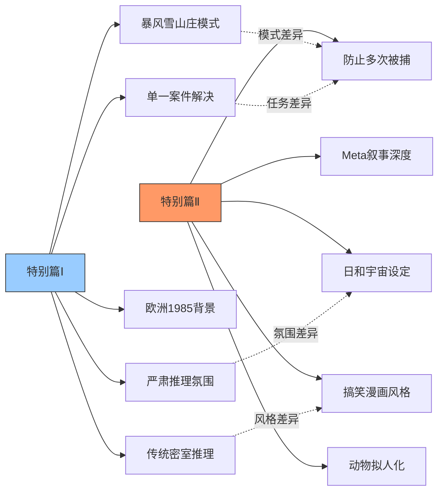
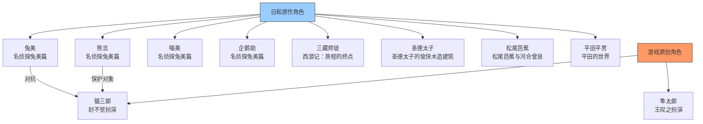
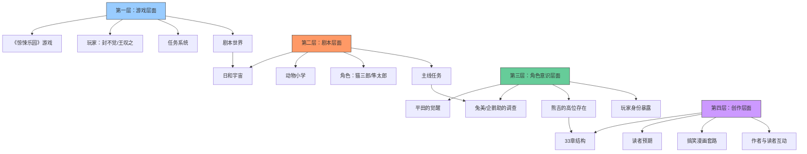
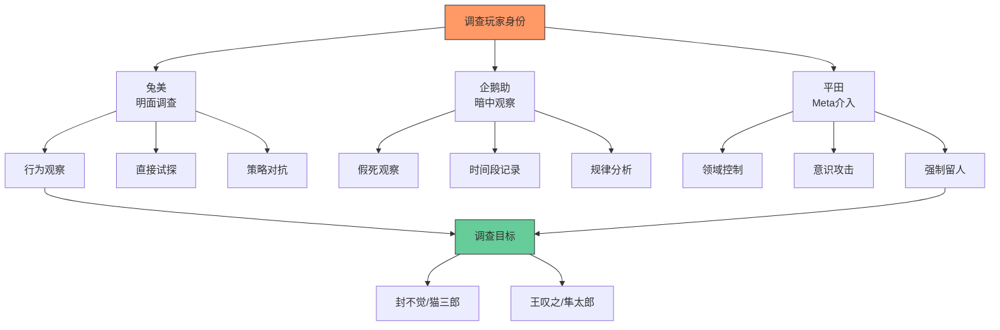
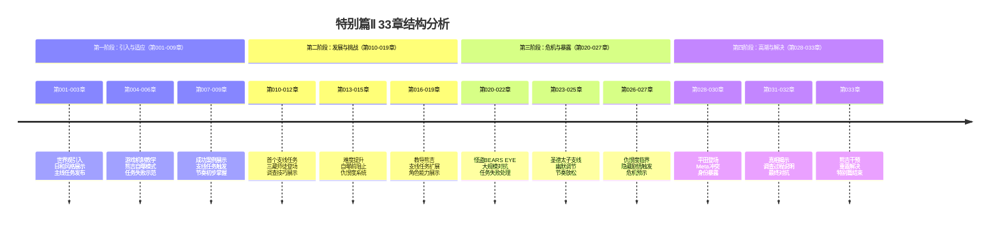
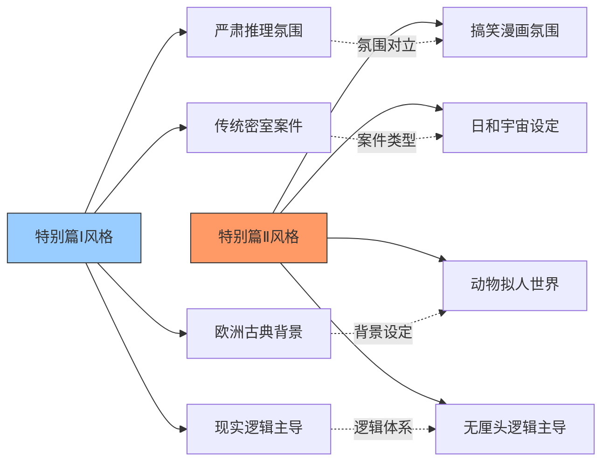

# 《惊悚乐园》特别篇Ⅱ 侦探被迫归来 - 完整分析

> **分析对象**：《惊悚乐园》特别篇Ⅱ 侦探被迫归来（第001-033章）
> **分析重点**：日和风格、meta叙事、游戏系统融合、幽默桥段
> **分析目的**：提炼搞笑漫画与游戏系统融合的创作技巧
> **分析时间**：2026年2月25日
> **对比参考**：特别篇Ⅰ侦探分析

## 一、文档概述

### 1.1 特别篇Ⅱ基本信息
- **篇幅**：33章完整故事
- **类型**：游戏内剧本、搞笑漫画、meta叙事
- **世界观**：日和宇宙（《搞笑漫画日和》）
- **地点设定**：动物小学、日和世界
- **核心设定**：玩家扮演动物角色，防止熊吉被捕超过10次

### 1.2 与特别篇Ⅰ的核心差异

## 二、日和风格深度分析

### 2.1 日和宇宙的核心特征

#### 2.1.1 动物拟人化设定
**具体表现**：
1. **角色设计**：所有角色均为拟人化动物，保留部分动物特征
   - 猫三郎：猫爪、肉垫、夜视能力
   - 隼太郎：翅膀手、鹰眼视力、鸟喙
   - 熊吉：熊的外貌、变态绅士属性
   - 兔美：兔子耳朵、锐利眼神

2. **社会结构**：动物小学、动物警察、拟人化社会体系
3. **物理规则**：保留部分动物特性（猫怕水、隼视力好）

#### 2.1.2 日和式幽默风格
**特征分析**：
1. **快速节奏**：对话和情节推进极快
2. **夸张表现**：表情、动作、反应的极度夸张
3. **无厘头逻辑**：看似合理实则荒谬的推理
4. **重复梗**：兔美的"眼神变得锐利"、熊吉的自曝

**示例分析**（第001章）：
> "欢迎来到，惊悚乐园，呼呼呼……"两秒后，一个猥琐的男声道出了开场白，说完后，他还卖萌般奸笑了三声。
> → 日和特有的猥琐幽默风格

#### 2.1.3 画风文字化呈现
**文字描述中的视觉元素**：
1. **简笔画风**：儿童涂鸦般的背景描述
2. **走形画风**：猎奇、夸张的人物形象
3. **色彩描述**：鲜艳、对比强烈的色彩
4. **表情描写**：极度夸张的表情变化

**示例**（第001章）：
> 而这CG的画风……不经让他想起了之前通过的另一个剧本（或者说沙盒）。
> "比起《南方公园》来……这是另一种意义上的猎奇吧……"

### 2.2 日和角色原型与改编

#### 2.2.1 主要角色来源

#### 2.2.2 角色属性的游戏化改造
**熊吉的变态绅士属性**：
- **原作设定**：频繁犯罪、立即自曝、屡教不改
- **游戏改造**：成为主线任务保护对象
- **功能转变**：从单纯的搞笑角色变为游戏机制核心

**兔美的名侦探属性**：
- **原作设定**：锐利眼神、喜欢报警、快速破案
- **游戏改造**：成为玩家的主要对抗对象
- **难度调整**：适当"放水"以维持游戏平衡

### 2.3 日和叙事节奏的把握

#### 2.3.1 快速转场机制
**游戏系统与日和风格的融合**：
1. **系统转场**：【X天后，地点】的直接切换
2. **日和节奏**：符合日和快速推进的叙事风格
3. **游戏功能**：跳过无关时间，聚焦关键事件
4. **幽默效果**：突兀转场本身成为笑点

**示例**（第003章）：
> 【第二天，上午。】一句旁白式的系统语音突兀地在其耳边响起。
> 同一瞬，他眼前的景物骤然一变，从教室变成了一条街道。

#### 2.3.2 槽点密度控制
**每章的槽点分布**：
- **高密度槽点章**：第001、002、008、015章（熊吉自曝密集）
- **中密度槽点章**：第005、010、018、024章（推理与幽默平衡）
- **低密度槽点章**：第028、029、030章（严肃meta叙事）

**槽点类型统计**：
- **熊吉自曝型**：40% - 犯罪后立即暴露证据
- **兔美锐利眼神**：20% - 固定梗的重复使用
- **日和角色登场**：20% - 三藏、太子等经典角色
- **系统互动吐槽**：20% - 对游戏系统的日和式反应

## 三、Meta叙事与游戏系统融合

### 3.1 多层次Meta结构

#### 3.1.1 Meta层次分析

#### 3.1.2 33章结构的Meta意义
**特别篇Ⅰ vs 特别篇Ⅱ的33章运用**：
- **特别篇Ⅰ**：单纯的章节数目标，增加趣味性
- **特别篇Ⅱ**：成为剧情关键，角色意识到"33章"的设定
- **进化体现**：从表面设定到深度融入剧情

**示例**（第001章）：
> 【用三十三章的篇幅，完成该剧本。】
> "沃……德~法克？"这句话，是封不觉发自内心的第一反应。

### 3.2 游戏系统与日和世界的冲突与融合

#### 3.2.1 系统提示的日和化处理
**提示风格的调整**：
1. **格式化保留**：仍使用【】框起系统提示
2. **内容日和化**：提示内容符合日和幽默风格
3. **角色反应**：封不觉的吐槽符合日和节奏
4. **功能扩展**：提示不仅是功能，更是笑点来源

**示例**（第001章主题曲）：
> 【在庭院里栖息着恶魔。】
> 【能够依靠的同伴都一脸死相。】
> "喂……什么情况……"片头CG还没出来，耳边就响起了两句用日语演唱的歌词...

#### 3.2.2 任务系统的创新设计
**主线任务特点**：
- **非传统目标**：不是破案，而是防止破案
- **重复性挑战**：33章内多次相同类型的任务
- **难度递增**：从"被捕前阻止"到"自曝前阻止"
- **失败惩罚**：熊吉仇恨度系统

**支线任务系统**：
- **触发条件**：每成功扰乱3次调查
- **任务类型**：协助破案、见证对决、生存挑战等
- **奖励机制**：技巧值、经验值、特殊物品
- **世界观扩展**：引入更多日和角色

#### 3.2.3 仇恨度系统的深层含义
**系统功能**：
1. **数值量化**：熊吉对玩家的好感/恶感数值化
2. **行为反馈**：玩家行动直接影响NPC态度
3. **隐藏机制**：达到100%触发隐藏剧情
4. **叙事工具**：暗示熊吉的真实本质

**游戏意义**：
- **帮助越多，仇恨越高**：违反直觉的设计
- **最终揭示**：熊吉不希望玩家破坏"漫画剧情"
- **Meta呼应**：角色对"玩家干预"的本能抗拒

### 3.3 玩家身份的双重性

#### 3.3.1 角色扮演的层次
**封不觉/猫三郎的双重身份**：
1. **玩家身份**：关注系统、任务、游戏进度
2. **角色身份**：禽兽小学转校生、名侦探
3. **表演身份**：在日和世界中扮演"猫三郎"
4. **被观察身份**：被日和角色怀疑的"高次元生物"

#### 3.3.2 身份暴露的叙事设计
**逐步暴露过程**：
- **第一阶段**（第001-015章）：兔美和企鹅助的怀疑
- **第二阶段**（第016-027章）：调查与试探
- **第三阶段**（第028-032章）：平田的介入与真相揭示
- **第四阶段**（第033章）：熊吉的干预与重置

**暴露线索**：
1. **行为异常**：对熊吉被捕的异常反应
2. **知识超常**：对日和世界的深入了解
3. **时间控制**：玩家控制角色的时间段规律
4. **任务驱动**：明确且不合常理的行为目标

## 四、幽默桥段分类与创新

### 4.1 日和式幽默的特殊类型

#### 4.1.1 自曝型幽默
**熊吉的犯罪自曝模式**：
1. **立即自曝**：犯罪后立即拿出证据
2. **详细说明**：对自己的犯罪行为进行解说
3. **毫无自觉**：完全不觉得自己的行为有问题
4. **重复循环**：同样模式反复出现，形成固定笑点

**示例**（第014章）：
> "啊，那个啊……不必了……"话音未落，他已站了起来，分别从裤子两侧的口袋里掏出了两只袜子，"擦水的话……我有更好的东西呢~呼呼呼呼~"

#### 4.1.2 锐利眼神梗
**兔美的固定幽默模式**：
- **触发条件**：发现案件或怀疑熊吉时
- **表现形式**："眼神变得锐利起来"
- **熊吉解说**：每次都有不同的"异名"介绍
- **功能扩展**：从单纯笑点到叙事信号

**异名收集**：
1. "兔美的眼神好糟糕"（第001章）
2. "好大一双眼"（第006章）
3. "吓了一跳啊"（第026章）
4. 每次都有微妙不同的描述

#### 4.1.3 日和角色登场幽默
**经典角色登场效果**：
1. **熟悉感**：日和粉丝的会心一笑
2. **属性再现**：完美还原原作角色特点
3. **跨作品互动**：不同日和故事的融合
4. **剧情功能**：不仅是客串，更有剧情作用

**示例角色**：
- **三藏师徒**：第010-012章，吃掉了八戒
- **圣德太子**：第024-026章，学校体验日
- **松尾芭蕉**：第017-018章，俳句对决
- **平田平男**：第028-033章，meta觉醒

### 4.2 游戏系统特有的幽默

#### 4.2.1 系统提示的幽默化
**提示内容的搞笑设计**：
1. **主题曲歌词**：用日和OP作为剧本开场
2. **任务描述**：日和风格的任务说明
3. **惩罚提示**：消极游戏的幽默警告
4. **转场语音**：日和式场景切换描述

**示例**（第004章消极游戏）：
> 【由于消极游戏，您被扣除30%生存值，及技巧值100点】
> 觉哥进入《惊悚乐园》至今，还是第一次听到有关消极游戏的惩罚语音。

#### 4.2.2 玩家反应的日和化
**封不觉吐槽风格的调整**：
- **吐槽密度**：比特别篇Ⅰ更高频
- **吐槽对象**：系统、熊吉、日和世界设定
- **吐槽风格**：更接近日和角色的快速吐槽
- **Meta吐槽**：对33章结构、读者预期的吐槽

**示例**（第016章）：
> "人家的主角可都是吃香的、喝辣的、杀BOSS、吞宝物、顺带收几十个性格各异的绝色后宫终日过着酒色过度的糜烂生活呢……"

### 4.3 幽默与叙事的深度结合

#### 4.3.1 幽默作为叙事工具
**熊吉自曝的叙事功能**：
1. **推进剧情**：自曝触发案件解决
2. **控制节奏**：自曝频率控制故事进度
3. **角色塑造**：通过自曝展现熊吉本质
4. **主题表达**：自曝与重置的循环体现日和世界观

#### 4.3.2 固定梗的叙事进化
**"锐利眼神"的功能演变**：
- **初期**：单纯的笑点，熊吉的解说
- **中期**：兔美发现案件的信号
- **后期**：玩家与兔美对抗的标志
- **最终**：日和世界规则的体现

#### 4.3.3 Meta幽默的层次
**不同读者能get的幽默**：
- **表层读者**：直接的搞笑对话和情景
- **中层读者**：理解日和梗、角色原型的幽默
- **深层读者**：理解Meta设定、游戏系统互动的幽默
- **核心读者**：理解33章结构、作者意图的Meta幽默

**示例层次分析**（第001章主题曲）：
- **表层**：日语歌词很搞笑
- **中层**：这是日和第一季OP的歌词
- **深层**：系统用日和OP作为剧本开场是Meta幽默
- **核心**：这是对游戏剧本开场方式的日和化改造

## 五、角色塑造与关系网络

### 5.1 玩家角色的双重塑造

#### 5.1.1 封不觉/猫三郎的角色融合
**玩家与角色的互动模式**：
1. **能力继承**：封不觉的智力、观察力、吐槽能力
2. **属性限制**：猫的特性（夜视、怕水、肉垫）
3. **身份适应**：在日和世界中扮演"名侦探猫三郎"
4. **行为调整**：吐槽风格向日和节奏靠拢

**塑造技巧**：
- **内在一致**：封不觉的核心性格保持不变
- **外在适应**：行为方式适应日和世界规则
- **冲突设计**：玩家思维与日和逻辑的冲突
- **成长体现**：逐渐掌握日和世界的生存法则

#### 5.1.2 王叹之/隼太郎的角色特点
**与封不觉的对比塑造**：
- **智力水平**：封不觉主导，王叹之辅助
- **幽默风格**：封不觉主动吐槽，王叹之被动吐槽
- **角色能力**：猫的夜视 vs 隼的远视
- **成长轨迹**：封不觉主导策略，王叹之执行细节

### 5.2 日和角色的游戏化改造

#### 5.2.1 熊吉：从搞笑角色到Meta存在
**角色层次揭示**：
1. **表层**：频繁犯罪的变态绅士
2. **中层**：主线任务保护对象
3. **深层**：意识到玩家存在的观察者
4. **核心**：日和世界的高位存在，维护"漫画剧情"

**塑造技巧**：
- **渐进揭示**：从单纯搞笑到复杂Meta存在
- **行为矛盾**：帮助他脱罪反而增加仇恨度
- **最终反转**：第033章展现真实能力和目的
- **主题承载**：代表日和角色对自身存在的态度

#### 5.2.2 兔美：从固定梗到智能NPC
**角色功能进化**：
- **初期功能**：固定梗（锐利眼神）、案件解决者
- **中期功能**：玩家对抗对象、难度调节器
- **后期功能**：调查玩家身份的智能NPC
- **最终定位**：日和世界规则的执行者

**智能表现**：
1. **观察能力**：注意到玩家行为异常
2. **推理能力**：与企鹅助合作调查玩家
3. **策略能力**：制定"以退为进"的调查策略
4. **配合能力**：与平田、企鹅助协同行动

#### 5.2.3 企鹅助：隐藏的观察者
**角色定位**：
- **表面身份**：动物小学学生、名侦探
- **秘密身份**：假死以调查玩家
- **功能角色**：兔美的暗中搭档
- **叙事工具**：玩家身份暴露的关键推手

**塑造特点**：
- **低调存在**：前期戏份不多，后期重要性凸显
- **智力相当**：与兔美智力水平匹配
- **合作模式**：明确分工（兔美在明，企鹅助在暗）
- **最终归宿**：被熊吉重置记忆

### 5.3 客串角色的功能设计

#### 5.3.1 三藏师徒：世界观扩展
**登场功能**：
1. **世界观展示**：引入"吃掉了八戒"的日和黑暗幽默
2. **支线任务**：提供"无尸杀人事件"支线
3. **角色对比**：展现日和角色的不同智能层次
4. **幽默密度**：增加章节的槽点和笑点

**叙事作用**：
- **节奏调节**：在主线紧张中插入支线放松
- **难度展示**：相对简单的支线任务
- **角色互动**：展示封不觉对付日和角色的技巧
- **主题呼应**：同样是被"创作"的角色，但接受命运

#### 5.3.2 圣德太子：幽默调节
**登场功能**：
1. **幽默注入**：太子和妹子的逗捧关系
2. **支线任务**：提供学校体验日支线
3. **角色特点**：展现日和角色的典型槽点
4. **叙事休息**：在主线密集中提供轻松段落

**塑造特点**：
- **属性还原**：完美还原太子原作特点
- **功能明确**：纯粹提供幽默和支线
- **互动设计**：封不觉用"女朋友"问题击溃太子
- **主题连接**：同样是高位存在但选择搞笑

#### 5.3.3 平田平男：Meta核心
**角色定位**：
- **Meta代表**：第一个意识到自己是漫画角色的日和人物
- **冲突核心**：玩家身份暴露的直接推动者
- **能力展示**：Consciousness attack、领域控制
- **主题表达**：对自身存在意义的痛苦思考

**叙事功能**：
1. **高潮推进**：第028-032章的核心冲突
2. **主题深化**：将Meta叙事推向哲学层面
3. **能力展示**：展现日和角色可能具有的超常能力
4. **对比设置**：与熊吉形成对待"被创作"的两种态度

### 5.4 角色关系网络

#### 5.4.1 调查网络

#### 5.4.2 保护网络
**玩家与熊吉的关系演变**：
1. **任务对象**：初期只是需要保护的任务NPC
2. **教导对象**：中期试图教导熊吉避免被捕
3. **仇恨对象**：帮助越多，熊吉仇恨度越高
4. **拯救对象**：最终被熊吉所救，关系反转
5. **高位存在**：意识到熊吉的真实本质

## 六、叙事结构与节奏控制

### 6.1 33章结构分析

#### 6.1.1 章节功能分布

#### 6.1.2 节奏变化模式
**紧张-放松的循环设计**：
- **紧张段**：2-3章连续的主线任务
- **放松段**：1-2章的支线任务或幽默章节
- **高潮段**：第028-032章的连续紧张
- **解决段**：第033章的快速解决

**示例节奏**：
- 第001-003章（紧张引入）→ 第004-006章（教学放松）
- 第007-009章（紧张成功）→ 第010-012章（支线放松）
- 第013-015章（紧张提升）→ 第016-019章（支线扩展）
- 第020-022章（紧张高潮）→ 第023-025章（幽默放松）
- 第026-033章（连续紧张高潮）

### 6.2 任务系统与叙事推进

#### 6.2.1 主线任务设计
**防止熊吉被捕的任务特点**：
1. **重复性**：相同类型的任务反复出现
2. **渐进性**：难度逐步提升（被捕前→自曝前）
3. **惩罚性**：失败有明确惩罚（被捕次数+1）
4. **限制性**：10次机会的紧张感

**叙事功能**：
- **结构框架**：33章内10次机会的基本框架
- **节奏控制**：任务成功/失败控制故事进度
- **角色互动**：通过任务展现玩家与NPC关系
- **主题表达**：保护搞笑角色不被捕的Meta意义

#### 6.2.2 支线任务系统
**触发与功能**：
- **触发条件**：每成功扰乱3次调查
- **类型多样**：破案、对决、生存、指引等
- **奖励机制**：技巧值、经验值、特殊物品
- **世界观扩展**：引入更多日和角色和故事

**叙事作用**：
1. **节奏调节**：在主线紧张中提供变化
2. **角色展示**：展示更多日和角色特点
3. **能力证明**：玩家在不同类型任务中的表现
4. **幽默注入**：支线通常更轻松幽默

### 6.3 悬念与反转设计

#### 6.3.1 多层次悬念系统
**短期悬念**（章级）：
- **熊吉自曝**：这次会如何自曝？
- **玩家应对**：如何帮熊吉脱罪？
- **任务结果**：成功还是失败？

**中期悬念**（阶段级）：
- **仇恨度系统**：达到100%会发生什么？
- **玩家身份**：何时会被NPC识破？
- **支线规律**：支线任务的触发规律？

**长期悬念**（特别篇级）：
- **33章目标**：能否在33章内完成任务？
- **Meta真相**：日和角色对自身存在的认知？
- **最终解决**：特别篇如何结束？

#### 6.3.2 关键反转设计
**主要反转点**：
1. **第004章**：消极游戏惩罚，展示任务失败后果
2. **第014章**：熊吉立即自曝被捕，展示难度提升
3. **第022章**：怪盗BEARS EYE大规模围捕，任务失败
4. **第028章**：平田登场，玩家身份暴露危机
5. **第033章**：熊吉真实能力展现，最终解决

**反转技巧**：
- **铺垫充分**：每个反转都有前期铺垫
- **逻辑合理**：在日和世界观内逻辑自洽
- **影响重大**：每次反转都改变故事走向
- **主题相关**：反转都服务于Meta主题

## 七、创作技巧提炼与应用

### 7.1 搞笑漫画与游戏系统的融合技巧

#### 7.1.1 世界观融合方法
**具体技巧**：
1. **属性继承**：保留原作角色核心属性
2. **规则适应**：游戏规则适应搞笑漫画逻辑
3. **风格统一**：系统提示、任务描述符合原作风格
4. **互动设计**：玩家行为符合角色在原作中的行为模式

**示例应用**：
- **熊吉自曝**：原作属性 → 游戏任务机制
- **兔美眼神**：原作梗 → 游戏叙事信号
- **快速转场**：日和节奏 → 游戏系统功能
- **Meta设定**：日和风格 → 游戏深度叙事

#### 7.1.2 幽默系统化设计
**将幽默转化为游戏机制**：
1. **固定梗机制化**：兔美眼神作为任务触发信号
2. **角色属性任务化**：熊吉自曝作为任务挑战
3. **吐槽互动化**：玩家吐槽影响NPC反应
4. **Meta幽默系统化**：33章结构作为任务目标

### 7.2 Meta叙事的层次设计

#### 7.2.1 多层次Meta结构构建
**构建方法**：
1. **表层Meta**：33章结构、读者预期调侃
2. **中层Meta**：角色对游戏系统的认知
3. **深层Meta**：角色对自身被创作的认知
4. **核心Meta**：不同角色对"被创作"的态度差异

**应用技巧**：
- **渐进揭示**：从表层到核心逐步深入
- **角色分化**：不同角色代表不同Meta层次
- **冲突设计**：不同Meta认知产生冲突
- **主题统一**：所有Meta层次服务于统一主题

#### 7.2.2 玩家身份暴露的叙事设计
**暴露过程设计**：
1. **怀疑阶段**：NPC注意到玩家行为异常
2. **调查阶段**：NPC系统调查玩家身份
3. **确认阶段**：NPC确认玩家"高次元生物"身份
4. **对抗阶段**：NPC与玩家的Meta对抗
5. **解决阶段**：Meta冲突的最终解决

**设计要点**：
- **线索合理**：暴露线索在故事中合理出现
- **节奏控制**：暴露过程与故事节奏匹配
- **冲突升级**：暴露后的冲突逐步升级
- **解决合理**：在作品世界观内合理解决

### 7.3 重复性任务的趣味性保持

#### 7.3.1 防止任务重复枯燥的方法
**特别篇Ⅱ的成功做法**：
1. **难度递增**：从简单到复杂的任务设计
2. **机制变化**：不同阶段任务机制不同
3. **角色成长**：玩家逐渐掌握技巧的过程
4. **意外事件**：插入支线、反转等打破重复

**具体技巧**：
- **第一阶段**（第001-009章）：教学阶段，展示基本玩法
- **第二阶段**（第010-019章）：熟练阶段，增加难度变化
- **第三阶段**（第020-027章）：挑战阶段，加入大规模事件
- **第四阶段**（第028-033章）：Meta阶段，任务性质改变

#### 7.3.2 支线任务的节奏调节功能
**支线任务的设计原则**：
1. **类型差异**：与主线任务类型不同
2. **节奏相反**：主线紧张时支线轻松，反之亦然
3. **功能补充**：补充主线未展现的内容
4. **角色扩展**：引入主线未出现的角色

**特别篇Ⅱ的支线设计**：
- **无尸杀人事件**：相对严肃的推理支线
- **圣德太子学校体验**：纯粹幽默的支线
- **芭蕉曾良对决**：日和经典角色支线
- **狼人战斗**：动作型支线

### 7.4 角色智能的层次设计

#### 7.4.1 不同智能层次的角色设计
**日和角色的智能分化**：
1. **低智能层**：纯粹搞笑，无自我意识（多数日和角色）
2. **中智能层**：有一定智能，但接受搞笑设定（兔美、企鹅助）
3. **高智能层**：意识到自身存在，产生困惑（平田）
4. **顶级智能层**：完全认知自身，选择接受（熊吉、芭蕉、太子）

**设计意义**：
- **世界观完整**：展现日和世界的多样性
- **冲突来源**：不同智能层次产生冲突
- **主题表达**：通过不同选择表达主题
- **叙事层次**：增加故事的深度和复杂性

#### 7.4.2 NPC调查玩家的设计技巧
**兔美和企鹅助的调查设计**：
1. **观察细致**：注意到玩家行为的微小异常
2. **推理合理**：基于观察做出合理推理
3. **策略高明**：制定有效的调查策略
4. **合作默契**：明确分工，高效合作
5. **适度放水**：维持游戏可玩性的必要调整

## 八、与特别篇Ⅰ的对比总结

### 8.1 核心差异总结

#### 8.1.1 风格与氛围差异

#### 8.1.2 任务与目标差异
**特别篇Ⅰ**：
- **任务类型**：解决单一密室杀人案
- **目标明确**：找出真凶，揭示真相
- **推理过程**：传统调查、询问、推理
- **结局方式**：推理秀，真相大白

**特别篇Ⅱ**：
- **任务类型**：防止熊吉被捕超过10次
- **目标特殊**：不是破案，而是防止破案
- **过程重复**：相同类型任务反复出现
- **结局方式**：Meta冲突，角色重置

#### 8.1.3 Meta叙事深度差异
**特别篇Ⅰ的Meta层次**：
- **表层Meta**：33章结构调侃
- **功能Meta**：游戏系统与推理融合
- **深度有限**：未涉及角色自我意识

**特别篇Ⅱ的Meta层次**：
- **多层Meta**：游戏、剧本、角色意识、创作层面
- **哲学深度**：角色对自身存在的思考
- **冲突核心**：不同角色对"被创作"的态度
- **主题升华**：从单纯搞笑到存在主义探讨

#### 8.1.4 幽默风格与密度差异
**特别篇Ⅰ幽默特点**：
- **密度适中**：紧张推理中的适度幽默
- **类型传统**：主角吐槽、系统互动、情景幽默
- **功能辅助**：幽默服务于角色塑造和氛围调节
- **读者层次**：表层和中层幽默为主

**特别篇Ⅱ幽默特点**：
- **密度极高**：几乎每页都有笑点
- **类型多样**：日和式幽默、固定梗、Meta幽默
- **功能核心**：幽默本身就是叙事核心
- **读者层次**：包含深层和核心Meta幽默

### 8.2 进化与创新体现

#### 8.2.1 从特别篇Ⅰ到特别篇Ⅱ的进化
**叙事技巧的进化**：
1. **Meta层次深化**：从表面调侃到深度哲学探讨
2. **世界观融合**：从简单游戏设定到完整异世界融合
3. **角色智能提升**：NPC从功能角色到智能调查者
4. **任务设计创新**：从单一任务到复杂任务系统

**创作勇气的体现**：
- **风格大胆**：敢于尝试完全不同的风格
- **结构创新**：重复性任务的结构设计
- **主题深刻**：在搞笑中探讨严肃哲学问题
- **读者挑战**：要求读者理解多层Meta幽默

#### 8.2.2 特别篇Ⅱ的独特价值
**在《惊悚乐园》中的位置**：
1. **风格实验**：最大胆的风格尝试
2. **Meta巅峰**：Meta叙事的最高层次
3. **幽默极致**：将游戏幽默推向极致
4. **结构创新**：重复性叙事的成功尝试

**对后续创作的影响**：
- **风格拓展**：证明作品可以容纳完全不同风格
- **读者培养**：培养读者接受和理解Meta叙事
- **技巧积累**：为后续复杂叙事积累经验
- **信心建立**：建立尝试创新风格的信心

### 8.3 可借鉴的创作经验

#### 8.3.1 风格融合的成功经验
**搞笑漫画与游戏系统的融合**：
1. **属性保留**：保留原作核心属性和笑点
2. **规则适应**：游戏规则适应原作逻辑
3. **风格统一**：所有元素保持统一风格
4. **深度拓展**：在搞笑基础上增加深度

**具体应用建议**：
- **选择合适IP**：选择与游戏设定兼容的IP
- **深入理解原作**：准确把握原作精髓
- **创新而不失真**：在创新中保持原作魅力
- **层次化设计**：设计不同层次的阅读体验

#### 8.3.2 重复性叙事的有趣化
**特别篇Ⅱ的成功做法**：
1. **难度曲线**：逐步提升任务难度
2. **机制变化**：不同阶段不同任务机制
3. **意外插入**：支线任务打破重复
4. **角色成长**：玩家技巧的逐步提升

**避免重复枯燥的技巧**：
- **变化频率**：每3-5次重复后加入变化
- **类型交替**：不同类型任务交替出现
- **节奏控制**：紧张与放松段落交替
- **目标调整**：阶段性调整主要目标

#### 8.3.3 Meta叙事的层次设计
**多层次Meta构建技巧**：
1. **表层设计**：直接的Meta调侃和玩笑
2. **中层设计**：角色对游戏系统的认知
3. **深层设计**：角色对自身存在的认知
4. **核心设计**：不同认知产生的冲突和选择

**设计要点**：
- **渐进揭示**：从浅到深逐步揭示
- **角色代表**：不同角色代表不同层次
- **冲突设计**：不同层次产生戏剧冲突
- **主题统一**：所有层次服务于统一主题

## 九、分析总结与创作启示

### 9.1 特别篇Ⅱ的成功要素总结

#### 9.1.1 风格的大胆创新
**成功之处**：
1. **完全转型**：从严肃推理到搞笑漫画的彻底转变
2. **风格统一**：所有元素保持日和风格一致性
3. **读者接受**：在风格转变中保持读者兴趣
4. **深度保留**：在搞笑中保留叙事深度

#### 9.1.2 叙事结构的巧妙设计
**结构创新**：
- **重复性设计**：33章内重复相同类型任务
- **节奏控制**：紧张与放松的规律交替
- **支线系统**：支线任务调节节奏和扩展世界观
- **Meta框架**：33章结构作为Meta叙事框架

#### 9.1.3 角色塑造的层次丰富
**角色深度**：
- **玩家角色**：双重身份的自然融合
- **日和角色**：从单纯搞笑到复杂Meta存在
- **智能分化**：不同智能层次的角色设计
- **关系演变**：玩家与NPC关系的动态变化

#### 9.1.4 幽默与深度的完美平衡
**平衡艺术**：
- **表层搞笑**：直接的日和式幽默
- **中层趣味**：游戏系统与日和的互动幽默
- **深层思考**：Meta层面的哲学幽默
- **统一主题**：所有幽默服务于统一主题

### 9.2 对自身创作的启示

#### 9.2.1 风格创新的勇气
**特别篇Ⅱ的启示**：
1. **敢于尝试**：不局限于单一风格
2. **深入理解**：对新风格深入研究和理解
3. **读者信任**：相信读者能接受风格变化
4. **技巧积累**：通过尝试积累多风格创作技巧

**应用建议**：
- **小规模尝试**：先在小篇幅作品中尝试新风格
- **读者反馈**：密切关注读者对新风格的接受度
- **逐步深入**：从简单融合到深度创新
- **保持核心**：在创新中保持作品核心魅力

#### 9.2.2 Meta叙事的应用
**可借鉴的Meta技巧**：
1. **层次设计**：设计不同深度的Meta层次
2. **角色分化**：通过不同角色展现不同Meta认知
3. **冲突构建**：基于Meta认知构建戏剧冲突
4. **主题深化**：通过Meta叙事深化作品主题

**注意事项**：
- **读者准备**：确保读者准备好接受Meta叙事
- **逻辑自洽**：在作品世界观内逻辑自洽
- **适度使用**：避免过度Meta导致理解困难
- **功能明确**：Meta服务于叙事，而非炫技

#### 9.2.3 重复性结构的有趣化
**特别篇Ⅱ的经验**：
- **变化设计**：在重复中设计足够的变化
- **节奏控制**：通过节奏变化避免单调
- **目标调整**：阶段性调整任务目标和难度
- **意外元素**：插入意外事件打破重复

**应用场景**：
- **系列作品**：系列中相似结构的不同故事
- **游戏叙事**：游戏任务系统的叙事设计
- **单元剧集**：单元剧的重复结构设计
- **训练叙事**：角色成长训练过程的叙事

### 9.3 后续学习方向

#### 9.3.1 深度分析方向
1. **对比分析**：与其他搞笑漫画改编作品的对比
2. **读者反应分析**：读者对风格转变的接受度分析
3. **市场分析**：此类风格作品的市场定位分析
4. **技巧演化**：作者在后续作品中的技巧演化

#### 9.3.2 实践应用建议
1. **模仿练习**：尝试创作小篇幅的日和风格故事
2. **融合实验**：尝试其他风格与游戏系统的融合
3. **Meta尝试**：在作品中尝试适度Meta叙事
4. **结构创新**：尝试不同的叙事结构设计

#### 9.3.3 扩展学习资源
1. **日和原作**：深入阅读《搞笑漫画日和》原作
2. **类似作品**：其他游戏与搞笑漫画融合的作品
3. **Meta理论**：叙事学中的Meta叙事理论
4. **读者心理学**：读者接受风格变化的心理研究

## 十、附录：关键数据与索引

### 10.1 特别篇Ⅱ关键数据统计

#### 10.1.1 章节功能统计
- **引入章节**：第001-003章（世界观引入）
- **教学章节**：第004-006章（机制教学）
- **成功章节**：第007-009章（成功案例）
- **支线章节**：第010-012、017-018、024-026章
- **高潮章节**：第020-022、028-032章
- **解决章节**：第033章

#### 10.1.2 任务统计
- **主线任务次数**：熊吉被捕次数累计9次
- **成功扰乱次数**：约20-25次（具体根据玩家表现）
- **支线任务数量**：4个主要支线任务
- **任务失败次数**：至少2次（消极游戏、怪盗事件）

#### 10.1.3 角色登场统计
- **主要角色**：兔美、熊吉、喵美、企鹅助
- **玩家角色**：猫三郎、隼太郎
- **客串角色**：三藏师徒、圣德太子、松尾芭蕉、平田平男
- **总角色数**：约15-20个有名字的角色

### 10.2 学习重点章节索引

#### 10.2.1 风格学习章节
- **日和风格入门**：第001-003章
- **幽默密度控制**：第005、008、015章
- **固定梗运用**：第001、006、026章（兔美眼神）
- **角色登场设计**：第010、017、024、028章

#### 10.2.2 技巧学习章节
- **任务机制教学**：第004-006章
- **难度提升展示**：第013-015章
- **支线任务设计**：第010-012章
- **Meta叙事高潮**：第028-032章
- **结局解决技巧**：第033章

#### 10.2.3 综合应用章节
- **小规模综合**：第007-009章
- **中等规模综合**：第016-019章
- **大规模综合**：第020-027章
- **完整综合**：第028-033章

### 10.3 创作技巧快速索引

#### 10.3.1 风格融合技巧
- **属性继承**：§2.2.2
- **规则适应**：§3.2.1
- **风格统一**：§2.1.2
- **深度拓展**：§3.1.1

#### 10.3.2 叙事结构技巧
- **重复性设计**：§6.1.1
- **节奏控制**：§6.1.2
- **支线系统**：§6.2.2
- **悬念设计**：§6.3.1

#### 10.3.3 角色塑造技巧
- **双重身份**：§5.1.1
- **智能层次**：§7.4.1
- **关系演变**：§5.4.2
- **Meta塑造**：§5.2.1

#### 10.3.4 Meta叙事技巧
- **层次构建**：§7.2.1
- **冲突设计**：§7.2.2
- **主题统一**：§8.1.3
- **哲学深化**：§5.3.3

---

**文档版本**：1.0（完整版）
**分析完成时间**：2026年2月25日
**对比参考**：特别篇Ⅰ侦探分析（文档03）
**下次更新计划**：根据实际创作应用反馈进行修订

> **使用建议**：本分析文档重点在于搞笑漫画风格与游戏系统的融合技巧，以及Meta叙事的多层次设计。建议在借鉴时注意：
> 1. 根据自身作品风格调整幽默密度和类型
> 2. Meta叙事要适度，避免过度导致理解困难
> 3. 重复性结构设计需要足够的变化和节奏控制
> 4. 角色智能层次设计要符合作品世界观逻辑

> **特别提醒**：特别篇Ⅱ是《惊悚乐园》中风格最大胆、Meta层次最深的特别篇，其成功建立在读者对作品和作者的充分信任基础上。在借鉴时需要考虑自身作品的读者基础和风格定位。
</task_progress>