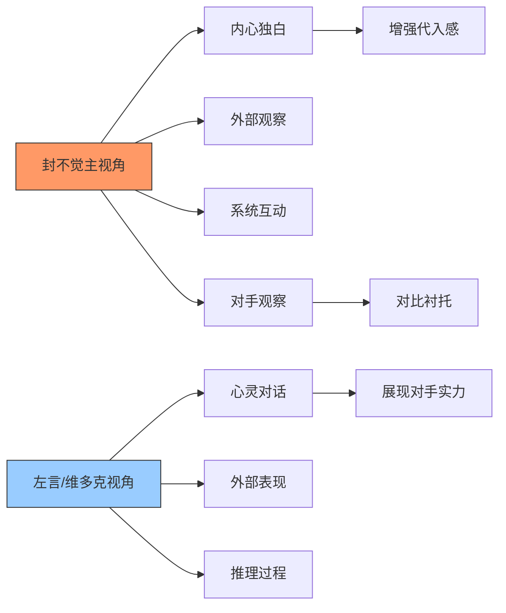
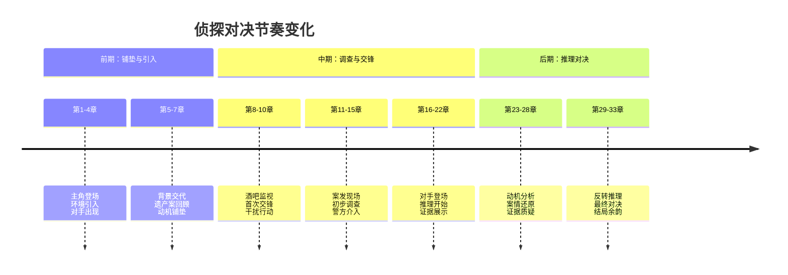
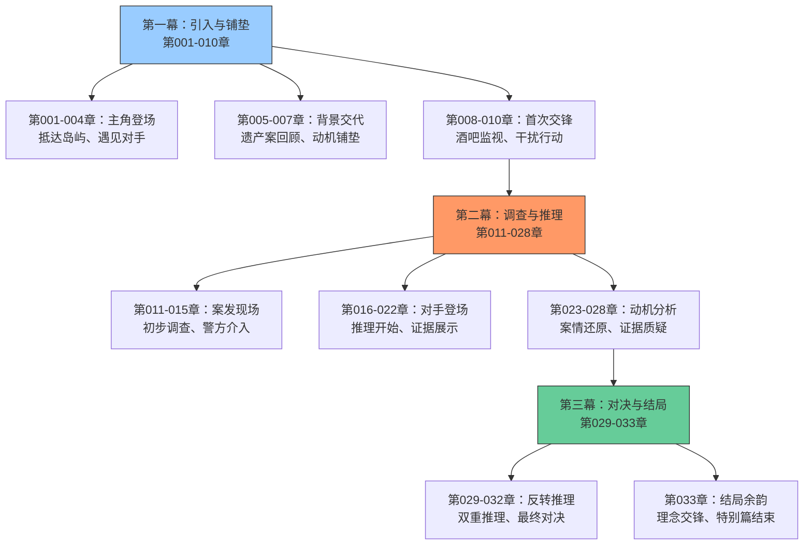
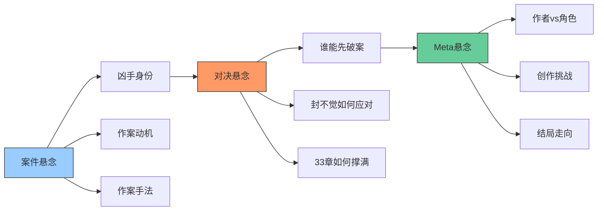
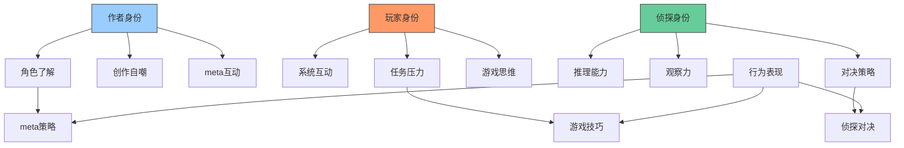
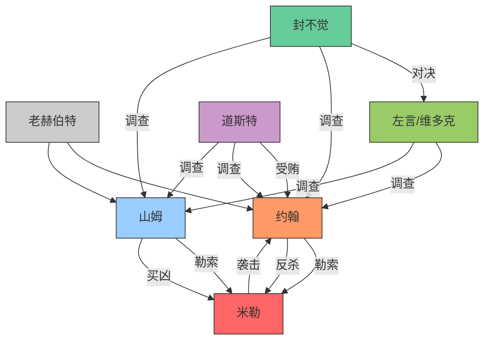
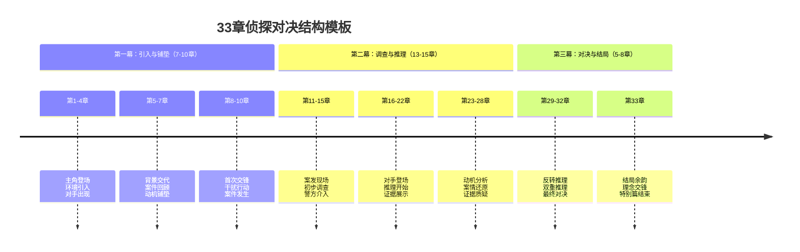

# 《惊悚乐园》特别篇Ⅲ 侦探VS二流侦探和猫 - 完整分析

> **分析对象**：《惊悚乐园》特别篇Ⅲ 侦探VS二流侦探和猫（第001-033章）
> **分析重点**：文风特色、情节构成、幽默桥段、写作技巧、侦探对决
> **分析目的**：提炼可借鉴的创作技巧，提升自身作品质量
> **分析时间**：2026年2月25日

## 一、文档概述

### 1.1 特别篇基本信息
- **篇幅**：33章完整故事
- **类型**：游戏内剧本、侦探对决、双重推理
- **时间设定**：二十一世纪一零年代
- **地点设定**：蔻奇柯缇岛（虚构岛屿）
- **核心设定**：玩家能力被限制，与作者笔下角色（左言、维多克）进行侦探对决

### 1.2 分析框架
本分析将从文风、情节、幽默、角色、技巧五个维度展开，深入剖析特别篇的成功要素和可借鉴之处，特别关注侦探对决的写作技巧。

## 二、文风特色深度分析

### 2.1 叙述视角与风格

#### 2.1.1 双侦探视角的巧妙切换

**具体表现**：
1. **主视角为主**：始终以封不觉的视角展开，但通过其敏锐观察力展现对手
2. **对手视角补充**：通过左言与维多克的心灵对话展现对手的推理过程
3. **对比与衬托**：通过封不觉对对手的观察和评价，衬托双方实力

**示例分析**（第003章）：
> "封不觉的内心，此刻正在滴血……" → 通过封不觉的反应展现对手的强大

#### 2.1.2 系统提示的叙事融合
**与特别篇Ⅰ的呼应**：
- **相同提示内容**：能力限制、服装修正等设定完全一致
- **任务目标相同**：用33章完成剧本的meta设定
- **玩家反应延续**：封不觉对系统的吐槽风格一致

**示例**（第001章）：
> 【重要提示：该剧本中无法使用任何由剧本外带入的物品；行囊栏已锁；技能栏已锁...】
> "喂喂……这词儿有点熟啊。"本就已经隐隐察觉出异常的觉哥...

### 2.2 语言节奏与密度

#### 2.2.1 侦探对决的节奏控制

#### 2.2.2 对话与推理的比例平衡
- **调查场景**：对话为主，快速推进（比例约6:4）
- **推理场景**：内心独白+对话+描写综合（比例约3:4:3）
- **对决场景**：对话交锋+心理活动（比例约5:5）

### 2.3 专业性与通俗性的平衡

#### 2.3.1 双重推理的呈现技巧
- **第一重推理**：左言/维多克的"正统推理" - 严谨、逻辑完整
- **第二重推理**：封不觉的"反转推理" - 颠覆、但逻辑自洽
- **对比呈现**：通过章节分段自然切换，避免混淆

**示例**（第028-032章）：
> 左言的完整推理 → 封不觉的质疑 → 封不觉的反转推理

#### 2.3.2 游戏设定与现实的融合
- **作者角色介入**：封不觉面对自己笔下的角色
- **meta层面幽默**：对写作、角色设定的自嘲
- **游戏任务限制**：33章篇幅的创作挑战

## 三、情节构成与结构设计

### 3.1 特别篇整体结构

#### 3.1.1 三幕式结构分析

#### 3.1.2 33章篇幅的精心分配
- **引入阶段**（第001-007章）：7章，占21%
- **案发阶段**（第008-015章）：8章，占24%
- **推理阶段**（第016-028章）：13章，占39%
- **解决阶段**（第029-033章）：5章，占15%

**设计意图**：推理阶段占比最大，符合侦探对决的核心乐趣——推理过程。

### 3.2 侦探对决设计

#### 3.2.1 双重推理的构建技巧
**第一重推理（左言/维多克）**：
1. **严谨性**：基于证据和逻辑的完整推理
2. **说服力**：逐步揭示，层层递进
3. **完整性**：动机、手法、证据链完整

**第二重推理（封不觉）**：
1. **颠覆性**：完全不同的案情解读
2. **逻辑自洽**：虽颠覆但逻辑完整
3. **目的性**：为完成任务（33章）而构建

**对决过程**：
- **证据质疑**：对录音证据的重新解读
- **逻辑重构**：用相同事实构建不同逻辑
- **理念交锋**：侦探理念的根本差异

#### 3.2.2 游戏设定对对决的增强
**作者优势的运用**：
1. **角色了解**：封不觉对自己笔下角色的了解
2. **meta层面**：作者与角色的对话
3. **创作挑战**：33章篇幅的自我挑战

**系统限制带来的挑战**：
1. **能力限制**：以普通人身份进行智力对决
2. **任务压力**：必须撑足33章
3. **对手强大**：面对自己创造的"完美侦探"

### 3.3 悬念与节奏控制

#### 3.3.1 多层次悬念系统

#### 3.3.2 节奏变化的具体表现
**紧张节奏段示例**（第010章）：
> "什么？"看到这条任务时，封不觉心中一惊，"‘约翰·赫伯特杀人事件’？"他不禁暗自吐槽道，"这货难道不该是被害人吗？"

**推理节奏段示例**（第027章）：
> "大约一年前，米勒设法找到了山姆，并且将约翰身世的秘密告诉了后者..."

**对决节奏段示例**（第030章）：
> "那照你的意思……"约翰又道，"山姆其实并没有从米勒那里得知我的身世秘密，所以他在昨天来到了岛上，准备跟我和好？"

## 四、幽默桥段分类分析

### 4.1 幽默类型与功能

#### 4.1.1 Meta幽默（元幽默）
**特点**：作者与角色、创作过程的自嘲
**功能**：增加趣味性、建立作者-读者共鸣

**示例分类**：
1. **作者自嘲**（第001章）：
   > "本卷内容根据由希区柯克所指导的影片《电话谋杀案》，以及由三天两觉（也就是我）所著短篇小说《二流侦探和猫》改编。"

2. **角色自嘲**（第004章）：
   > "身为作者，封不觉有一个极大的优势，那就是他对自己笔下的人物了如指掌..."

3. **创作自嘲**（第004章）：
   > "这样搞下去真的没问题吗……由于篇幅过分充裕，丧心病狂的作者已经开始对我进行各种猎奇的描述了……"

#### 4.1.2 系统互动型幽默
**特点**：玩家与游戏系统的幽默对话
**功能**：展现游戏特色、调节严肃氛围

**示例**（第001章）：
> "喂喂……这词儿有点熟啊。"本就已经隐隐察觉出异常的觉哥，在听到旁白的一瞬间就从记忆阁楼中翻出了类似的台词...

#### 4.1.3 对手互动型幽默
**特点**：侦探之间的幽默交锋
**功能**：展现角色性格、调节对决紧张感

**示例**（第003章）：
> "你要是不介意，可以叫我觉哥。"封不觉打断了他，用颇为亲切的态度言道。

### 4.2 幽默插入时机分析

#### 4.2.1 紧张推理中的幽默释放
**模式**：严肃推理 → meta幽默插入 → 情绪缓解

**示例流程**（第025章）：
1. **严肃推理**：左言进行严谨的案情分析
2. **幽默插入**：封不觉的meta吐槽
3. **对比强化**：严肃与幽默的反差
4. **节奏调节**：避免推理过程过于沉闷

#### 4.2.2 角色互动的意外幽默
**模式**：正常对话 → 意外幽默插入 → 氛围调节

**示例**（第018章）：
> 严肃的红酒话题中突然插入：
> "在你进酒窖前，你觉得我既没有能找出那瓶酒的见识、也没有敢拿出那瓶酒的勇气。"

### 4.3 幽默与角色塑造的融合

#### 4.3.1 通过幽默展现角色深度
**封不觉的幽默特点**：
- **Meta型幽默**：基于作者身份的自嘲
- **智力型幽默**：基于观察和推理的幽默
- **挑衅型幽默**：对决中的心理战术

**维多克的幽默特点**：
- **高傲型幽默**：基于能力的自信幽默
- **毒舌型幽默**：对左言的调侃
- **隐蔽型幽默**：通过左言转述的幽默

#### 4.3.2 不同角色的幽默差异化
- **封不觉**：作者、玩家、侦探的多重幽默
- **左言**：谦虚、温和的幽默
- **维多克**：高傲、毒舌的幽默
- **约翰**：商人式的冷幽默
- **山姆**：紧张中的尴尬幽默

## 五、角色塑造技巧分析

### 5.1 主角封不觉的多维度塑造

#### 5.1.1 三重身份的融合塑造

#### 5.1.2 对手面前的自我展现
**面对自己创造的角色**：
1. **了解优势**：对对手能力、性格的全面了解
2. **心理优势**：作者身份的自信
3. **策略优势**：基于了解的针对性策略

**对决中的成长**：
- **初期**：试图用简单方法解决问题（囚禁维多克）
- **中期**：正视对手，决定正面对决
- **后期**：运用智慧进行反转推理

### 5.2 对手角色的差异化塑造

#### 5.2.1 左言与维多克的组合塑造
**左言（二流侦探）**：
- **表面形象**：谦虚的大学生、推理社团部长
- **真实能力**：优秀的侦探助手、维多克的"代言人"
- **性格特点**：温和、谦虚、有原则

**维多克（侦探之王）**：
- **表面形象**：普通的英国短毛猫
- **真实能力**：侦探的顶点、全能侦探
- **性格特点**：高傲、毒舌、极度自信

**组合特点**：
- **互补性**：左言的人际能力 + 维多克的侦探能力
- **互动性**：心灵对话的独特设定
- **神秘性**：猫侦探的意外性

#### 5.2.2 对手与主角的对比塑造
**能力对比**：
- **封不觉**：作者优势、游戏思维、反转能力
- **维多克**：专业侦探、全能能力、严谨推理
- **左言**：人际能力、转述能力、辅助作用

**理念对比**：
- **封不觉**：结果导向、实用主义
- **左言/维多克**：真相导向、原则主义

**方法对比**：
- **封不觉**：meta策略、心理战术、反转推理
- **维多克**：严谨推理、证据链、逻辑完整

### 5.3 配角群像的塑造

#### 5.3.1 赫伯特家族成员
**约翰·赫伯特**：
- **表面形象**：成功商人、岛上的"国王"
- **真实面目**：伪造遗嘱、谋杀生父的罪犯
- **性格特点**：精明、冷酷、有恃无恐

**山姆·赫伯特**：
- **表面形象**：落魄的富二代、被冤枉者
- **真实行动**：买凶杀人的复仇者
- **性格特点**：被逼复仇、良心未泯

**老赫伯特（已故）**：
- **塑造方式**：通过他人回忆塑造
- **形象特点**：成功的商人、失败的父亲
- **故事作用**：遗产案的根源

#### 5.3.2 其他关键角色
**派特·米勒（死者）**：
- **生前形象**：落魄的前白领、多次犯罪者
- **真实角色**：勒索者、杀手、案件关键
- **塑造技巧**：通过社交媒体、犯罪记录等侧面塑造

**道斯特警长**：
- **角色功能**：警方代表、被左右的对象
- **性格特点**：收受贿赂、能力有限、破罐破摔
- **幽默作用**：通过他的反应衬托侦探的能力

### 5.4 角色关系的网络设计

#### 5.4.1 案件关系网络

#### 5.4.2 情感关系网络
- **血缘关系**：约翰与山姆的"兄弟"关系（实际无血缘）
- **仇恨关系**：山姆对约翰的杀父之仇、夺财之恨
- **利用关系**：米勒对约翰和山姆的双重勒索
- **合作关系**：山姆与米勒的买凶杀人合作
- **对立关系**：封不觉与左言/维多克的侦探对决
- **利益关系**：道斯特与约翰的贿赂关系

#### 5.4.3 理念关系网络
- **侦探理念**：封不觉（结果导向）vs 左言/维多克（真相导向）
- **正义理念**：法律正义 vs 个人正义
- **道德理念**：实用主义 vs 原则主义

## 六、写作技巧提炼与应用

### 6.1 侦探对决的写作技巧

#### 6.1.1 双重推理的构建方法
**构建步骤**：
1. **建立第一重推理**：严谨、完整、有说服力的"正统推理"
2. **预留反转空间**：在证据链中留下可重新解读的空间
3. **构建第二重推理**：基于相同事实但不同逻辑的"反转推理"
4. **设置对决场景**：让两种推理在对话中交锋
5. **理念升华**：通过推理对决展现角色理念差异

**具体应用**：
- **证据重新解读**：录音证据的双重解读
- **动机重构**：相同行为的不同动机解释
- **逻辑重构**：用相同事实构建不同逻辑链

#### 6.1.2 对手实力的展现技巧
**维多克实力的展现方式**：
1. **侧面衬托**：通过封不觉的反应展现对手强大
2. **能力展示**：通过心灵对话展现推理过程
3. **成果展示**：快速掌握案情、找到关键证据
4. **对比展现**：与左言的能力对比

**封不觉优势的展现方式**：
1. **作者优势**：对对手的了解
2. **meta策略**：利用游戏设定和任务限制
3. **心理战术**：在对话中施加压力
4. **反转能力**：构建颠覆性推理

#### 6.1.3 对决节奏的控制技巧
**节奏控制点**：
1. **引入阶段**：缓慢铺垫，建立对手形象
2. **交锋阶段**：快速推进，展现双方能力
3. **高潮阶段**：放慢节奏，详细展现推理过程
4. **结局阶段**：快速收尾，留下余韵

**章节分配技巧**：
- **前期**：较多章节用于铺垫和背景交代
- **中期**：集中章节用于推理和证据展示
- **后期**：较少章节用于对决和结局

### 6.2 Meta层面的写作技巧

#### 6.2.1 作者与角色的互动技巧
**互动方式**：
1. **直接互动**：封不觉面对自己笔下的角色
2. **间接互动**：通过游戏设定实现meta互动
3. **自嘲互动**：对创作过程的自嘲

**功能作用**：
- **增加趣味性**：meta幽默的娱乐效果
- **展现角色深度**：通过互动展现角色多面性
- **增强代入感**：让读者感受到创作的真实性

#### 6.2.2 游戏设定的meta运用
**设定运用**：
1. **任务限制**：33章篇幅的创作挑战
2. **能力限制**：以普通人身份进行智力对决
3. **系统互动**：游戏系统与剧情的融合

**创作意义**：
- **增加挑战性**：为创作增加限制和挑战
- **增强真实感**：游戏设定增加代入感
- **提供创作空间**：为meta互动提供平台

#### 6.2.3 创作自嘲的技巧
**自嘲类型**：
1. **作者自嘲**：对自身创作能力的自嘲
2. **角色自嘲**：角色对自身设定的自嘲
3. **创作过程自嘲**：对写作过程的自嘲

**自嘲时机**：
- **紧张场景后**：缓解紧张氛围
- **严肃推理中**：调节严肃气氛
- **角色互动时**：增加互动趣味性

### 6.3 推理小说的进阶技巧

#### 6.3.1 复杂案件的构建技巧
**案件要素设计**：
1. **多层动机**：表面动机 vs 深层动机
2. **复杂关系**：多重人物关系的交织
3. **时间跨度**：跨越多年的案件背景
4. **证据链设计**：可多重解读的证据

**构建步骤**：
1. **确定核心案件**：杀人案作为核心
2. **添加背景案件**：遗产案作为背景
3. **建立人物关系**：复杂的人物关系网络
4. **设计证据链**：可支持多重推理的证据

#### 6.3.2 角色心理的描写技巧
**心理描写方法**：
1. **内心独白**：直接展现角色内心
2. **行为表现**：通过行为展现心理
3. **对话暗示**：通过对话暗示心理
4. **环境烘托**：通过环境烘托心理

**心理变化轨迹**：
- **山姆**：从怨恨到复仇的心理变化
- **约翰**：从自信到恐慌的心理变化
- **封不觉**：从轻视到重视的心理变化
- **左言**：从谦虚到自信的心理变化

#### 6.3.3 对话写作的专业技巧
**侦探对话特点**：
1. **信息密集**：每句对话都有信息传递功能
2. **逻辑严密**：对话体现角色逻辑思维
3. **性格展现**：通过对话方式展现角色性格
4. **心理博弈**：对话中的心理战术

**对决对话技巧**：
- **提问技巧**：引导性、施压性、安抚性提问
- **回答技巧**：回避、转移、反问等回答方式
- **节奏控制**：对话节奏的快慢变化

## 七、可借鉴的创作技巧总结

### 7.1 侦探对决结构模板

#### 7.1.1 33章侦探对决模板

#### 7.1.2 章节内容分配原则
- **每章都有进展**：避免"水章节"
- **节奏变化规律**：紧张2-3章 → 放松1章
- **悬念设置频率**：每章至少1个小悬念
- **信息释放梯度**：逐步增加信息密度

### 7.2 角色塑造技巧

#### 7.2.1 侦探主角塑造模板
**封不觉式主角的塑造要素**：
1. **多重身份**：作者/玩家/侦探的三重身份
2. **核心能力**：观察力、推理力、meta策略
3. **性格特点**：幽默、自信、有点欠、实用主义
4. **成长轨迹**：从轻视对手到正面对决
5. **幽默风格**：meta幽默、智力幽默、挑衅幽默

#### 7.2.2 对手组合塑造技巧
**左言/维多克组合的塑造方法**：
1. **差异化设计**：人与猫的组合、能力互补
2. **互动方式**：心灵对话的独特设定
3. **实力展现**：通过侧面衬托和能力展示
4. **理念定位**：真相导向、原则主义

#### 7.2.3 反派塑造技巧
**约翰式反派的塑造特点**：
1. **表面形象**：成功、体面、有社会地位
2. **真实面目**：精明、冷酷、犯罪者
3. **犯罪特点**：计划周密、不留证据
4. **心理特点**：自信、有恃无恐
5. **结局设计**：被更聪明的对手击败

### 7.3 Meta写作技巧

#### 7.3.1 Meta互动的黄金法则
1. **适度原则**：meta元素不宜过多，避免破坏故事
2. **自然融入**：meta元素要自然融入剧情
3. **服务剧情**：meta元素要服务于剧情推进
4. **增强趣味**：meta元素要增加故事趣味性

#### 7.3.2 不同类型作品的meta适配
**推理作品的meta特点**：
- **作者介入**：作者与角色的互动
- **创作自嘲**：对写作过程的自嘲
- **游戏设定**：游戏与现实的融合
- **读者互动**：对读者预期的回应

#### 7.3.3 Meta效果的层次设计
**多层次meta设计**：
- **表层meta**：直接的自嘲和调侃
- **中层meta**：作者与角色的互动
- **深层meta**：对创作本质的探讨
- **长期meta**：贯穿始终的创作主题

### 7.4 悬念与节奏技巧

#### 7.4.1 侦探对决的悬念设置
**最佳悬念设置点**：
1. **对手登场时**：对手实力的悬念
2. **推理开始时**：推理结果的悬念
3. **证据出现时**：证据意义的悬念
4. **对决高潮时**：对决结果的悬念

#### 7.4.2 对决节奏的控制方法
**具体控制技巧**：
1. **章节长度控制**：紧张章节稍短，推理章节可稍长
2. **对话描写比例**：根据场景需要调整比例
3. **信息释放速度**：逐步加速，高潮时密集释放
4. **情绪起伏设计**：有意识设计情绪曲线

## 八、分析总结与创作建议

### 8.1 《惊悚乐园》特别篇Ⅲ的成功要素

#### 8.1.1 结构设计的成功之处
1. **33章的精巧安排**：适合完整侦探对决故事
2. **三幕式的经典结构**：引入、推理、对决的清晰划分
3. **节奏的精准控制**：铺垫、推理、对决的节奏变化
4. **悬念的多层次设置**：案件、对决、meta的多重悬念

#### 8.1.2 角色塑造的成功之处
1. **主角的立体塑造**：三重身份的完美融合
2. **对手的创新塑造**：人与猫的组合、心灵对话
3. **配角的差异化**：每个角色都有独特性和深度
4. **关系的复杂性**：多重人物关系的复杂交织

#### 8.1.3 风格融合的成功之处
1. **侦探与meta的融合**：严肃推理与幽默自嘲的平衡
2. **游戏与现实的结合**：游戏设定增强而非削弱推理
3. **传统与创新的调和**：经典推理结构与创新元素的结合
4. **严肃与幽默的平衡**：紧张推理中自然插入幽默

### 8.2 对自身创作的启示

#### 8.2.1 可直接借鉴的技巧
1. **侦探对决模板**：双重推理的对决结构
2. **meta互动方法**：作者与角色的互动技巧
3. **角色组合设计**：互补性角色组合的设计
4. **节奏控制方法**：侦探对决的节奏控制

#### 8.2.2 需要根据作品调整的技巧
1. **meta程度的把握**：根据作品基调调整meta元素
2. **游戏设定的应用**：根据作品类型调整游戏设定
3. **幽默风格的适配**：根据作品基调调整幽默类型
4. **推理难度的把握**：根据目标读者调整推理难度

#### 8.2.3 创新发展的方向
1. **设定融合创新**：尝试其他类型与推理的融合
2. **结构形式创新**：探索非传统的结构安排
3. **叙事视角创新**：尝试多视角或特殊视角
4. **互动形式创新**：开发新的读者互动方式

### 8.3 后续学习建议

#### 8.3.1 深度分析方向
1. **对比分析**：与其他侦探对决作品的对比
2. **作者风格分析**：三天两觉其他作品的分析
3. **读者反应分析**：读者评论和反馈的分析
4. **市场定位分析**：作品在市场上的定位和成功因素

#### 8.3.2 实践应用建议
1. **小规模尝试**：先在小篇幅作品中尝试技巧
2. **读者反馈收集**：及时收集读者对技巧应用的反馈
3. **持续调整优化**：根据反馈不断调整和优化
4. **个人风格形成**：在借鉴基础上形成个人独特风格

#### 8.3.3 扩展学习资源
1. **同类作品学习**：更多优秀侦探对决作品
2. **写作理论学习**：叙事学、角色塑造等理论
3. **读者心理学学习**：了解读者阅读心理和期待
4. **市场趋势关注**：关注文学市场的变化和趋势

---

## 九、附录：关键章节分析索引

### 9.1 重要章节功能分析
- **第001章**：主角登场、系统引入、meta设定
- **第003章**：对手出现、首次接触、心灵对话
- **第004章**：作者优势、对决决心、meta自嘲
- **第010章**：案件发生、任务更新、悬念设置
- **第016章**：对手登场、推理开始、证据展示
- **第028章**：第一重推理完成、证据质疑
- **第030章**：第二重推理开始、反转构建
- **第032章**：最终对决、理念交锋
- **第033章**：结局处理、余韵设置、特别篇结束

### 9.2 关键技巧出现章节
- **meta幽默**：第001、004、025章
- **系统互动**：第001、010章
- **心灵对话**：第003、005-007章
- **推理展示**：第016-028章
- **反转推理**：第029-032章
- **理念交锋**：第033章
- **节奏控制**：第008-010、023-028章

### 9.3 学习重点章节推荐
- **初学者**：第001-004章（基础技巧）
- **进阶者**：第016-028章（核心技巧）
- **高级者**：第029-033章（综合应用）
- **专项学习**：根据需要选择对应技巧章节

---

**文档版本**：1.0（完整版）
**最后更新**：2026年2月25日
**下次更新计划**：根据实际创作应用反馈进行修订

> **使用建议**：本分析文档可作为创作参考工具，建议根据自身作品特点选择性借鉴和应用相关技巧，在借鉴基础上发展个人独特风格。